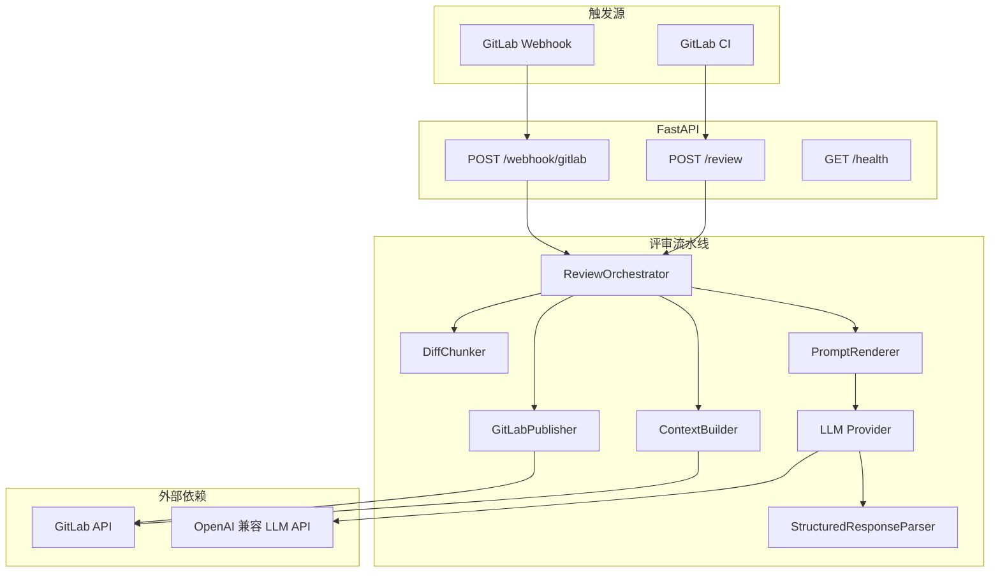

# AICR Reviewer 架构说明

## 概述

AICR Reviewer 是一个 FastAPI 服务，在 GitLab Merge Request 上执行 LLM 驱动的代码评审，并将结果写回 MR（行内讨论或 MR 备注）。

## 组件关系

## 评审流水线（ReviewOrchestrator）

1. **构建上下文**（`ContextBuilder`）
   - 拉取 MR 元数据、变更文件列表与 diff。
   - 对支持的扩展名尝试读取源分支完整文件内容。
   - 加载仓库内 `.llm/CONTEXT.md`（若存在），否则使用内置 Spring 默认约定。
   - CI 可经 `extra_diff` 注入额外 patch。

2. **分块**（`DiffChunker`）
   - 按 `REVIEW_MAX_INPUT_TOKENS` 估算字符上限切分多批，避免超出 LLM 上下文。
   - 单文件过大时截断 diff 并丢弃全文内容。

3. **调用 LLM**（每块一次）
   - Jinja2 模板渲染 system/user 提示词。
   - 发送前经 `redact_secrets` 脱敏。
   - 期望 JSON：`score`、`summary`、`issues[]`。

4. **聚合结果**
   - 多块取 **最低分** 作为最终分数。
   - 合并所有 `issues`；部分块失败时记录摘要，全部失败则抛 `LLMReviewError`。

5. **发布**（`GitLabPublisher`，`REVIEW_DRY_RUN=0` 时）
   - 每条 issue：优先行内 discussion，失败则回退为 MR note。
   - 发布总分摘要 note（与 `AICR_SCORE_THRESHOLD` 比较 PASSED/FAILED）。

## 目录与模块

| 路径 | 职责 |
|------|------|
| `app/api/routes.py` | HTTP 路由、鉴权、异常到 HTTP 状态映射 |
| `app/config.py` | 从 `evn/.env` 等加载环境变量 |
| `app/gitlab/client.py` | GitLab Python SDK 单例 |
| `app/gitlab/context_builder.py` | MR 上下文与文件列表 |
| `app/gitlab/publisher.py` | 评论与摘要发布 |
| `app/llm/factory.py` | 按 `LLM_PROVIDER` 创建客户端 |
| `app/llm/openai_compat.py` | OpenAI 兼容 Chat Completions |
| `app/review/orchestrator.py` | 流水线编排 |
| `app/review/chunker.py` | Diff 分块 |
| `app/review/parser.py` | LLM JSON 解析与规范化 |
| `app/review/prompt_renderer.py` | Jinja2 提示词 |
| `app/utils/redact.py` | 敏感信息脱敏 |

## HTTP 与失败策略

| 场景 | HTTP | 行为 |
|------|------|------|
| 无可审文件（无支持扩展名变更） | 200，`review_completed=false` | Runner 脚本放行 |
| 评审服务异常（鉴权/LLM/解析/GitLab/网络/超时/配置等） | 200，`review_completed=false` | Runner 脚本放行 |
| 评审成功但分数低于阈值 | 200，`review_completed=true`，低分 | **仅此时** `ci_review_gate.sh` 失败 job |
| 评审成功且达标 | 200，`review_completed=true`，高分 | 通过 |

MR 是否被拦由 **`aicr-reviewer/scripts/ci_review_gate.sh`** 在 GitLab Runner 中判定，而非 HTTP 状态码。
| Webhook 非 MR 或非 open/update/reopen | 200 ignored | 不触发评审 |

Webhook 评审在 `BackgroundTasks` 中异步执行，HTTP 立即返回 `accepted`。

## 配置加载顺序

`app/config.py` 依次尝试（不覆盖已存在变量）：

1. `<repo>/evn/.env`
2. `<repo>/.env`
3. `aicr-reviewer/.env`

## 扩展点

- **项目上下文**：在仓库添加 `.llm/CONTEXT.md` 描述团队规范。
- **LLM 提供商**：设置 `LLM_PROVIDER` 预设或自定义 `LLM_API_BASE` / `LLM_MODEL`。
- **提示词**：编辑 `app/review/prompts/*.j2`。
- **支持语言**：在 `ContextBuilder.SUPPORTED_EXTENSIONS` 中增减扩展名。
