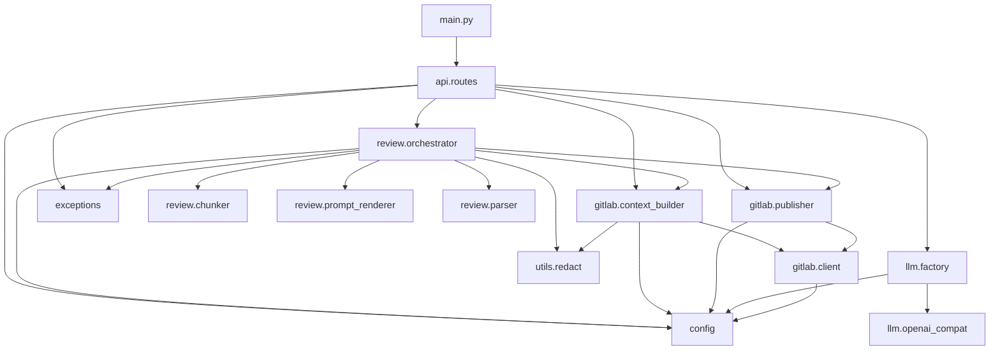
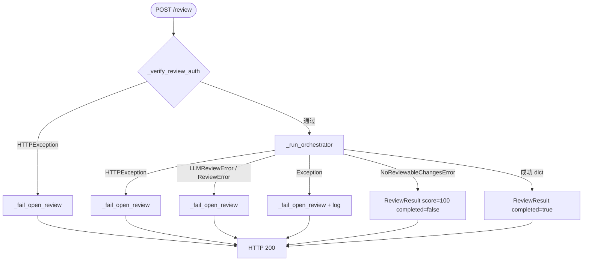
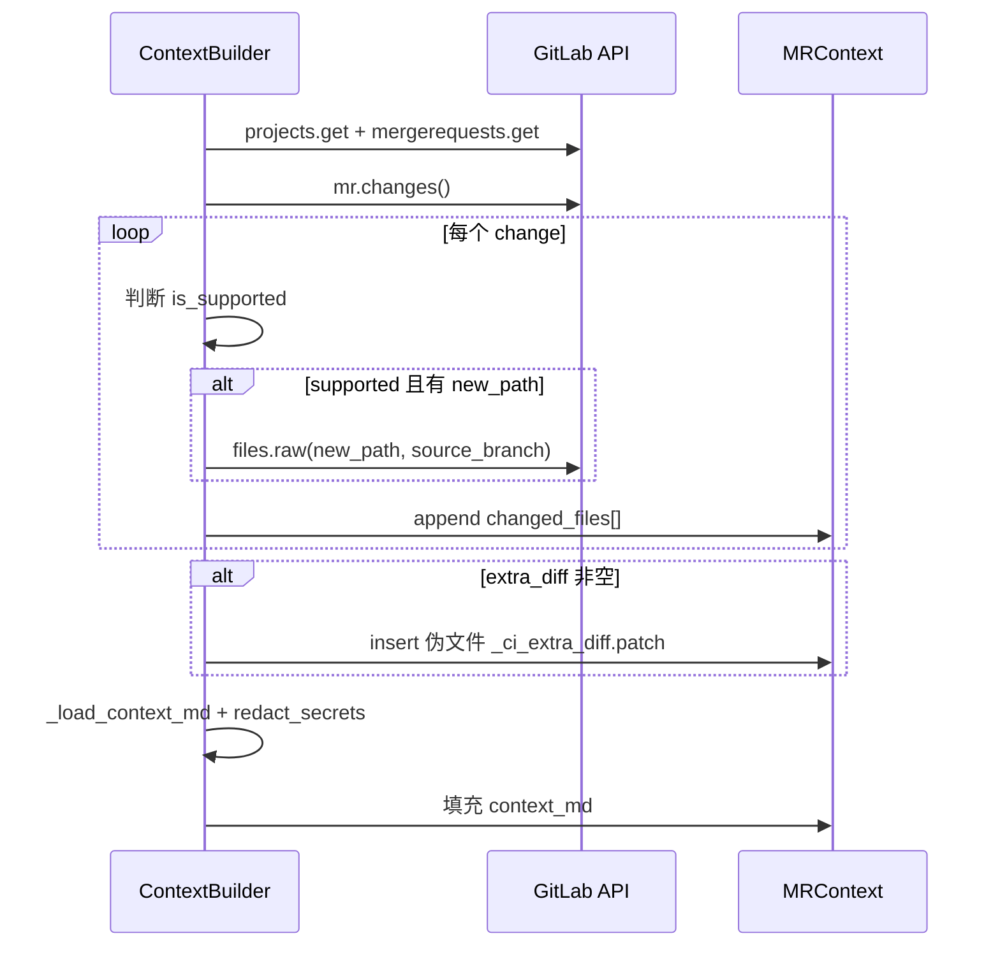
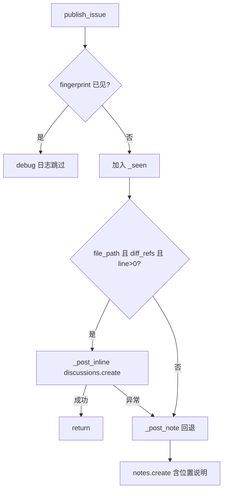
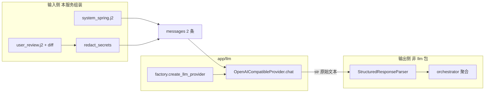
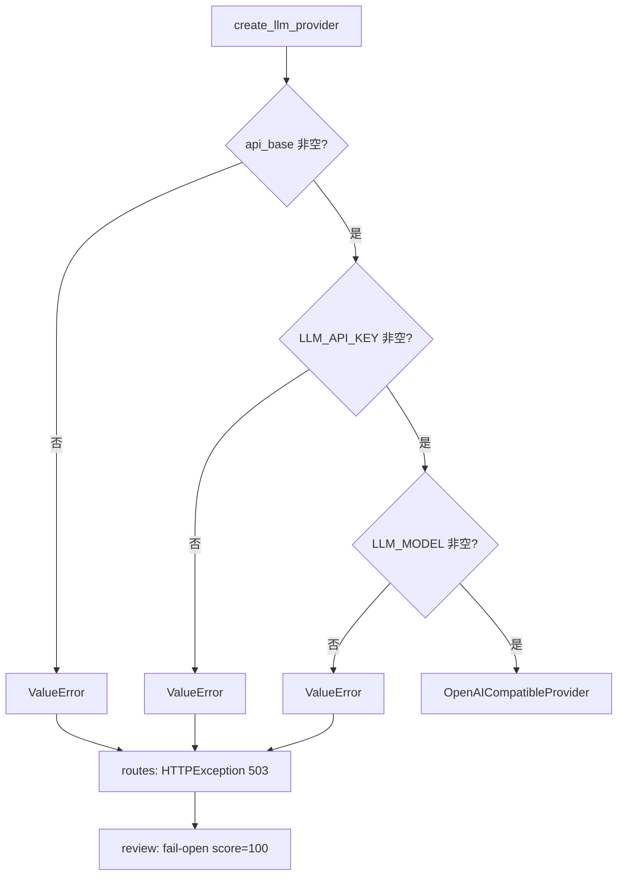
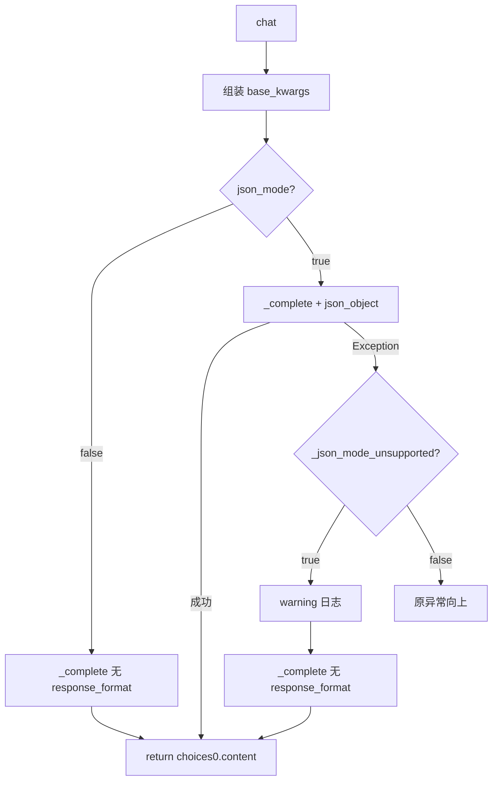
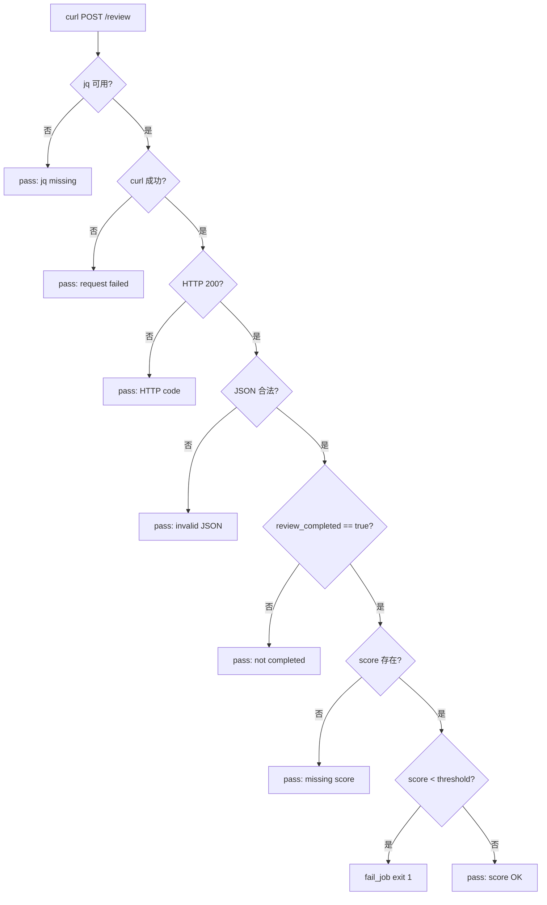
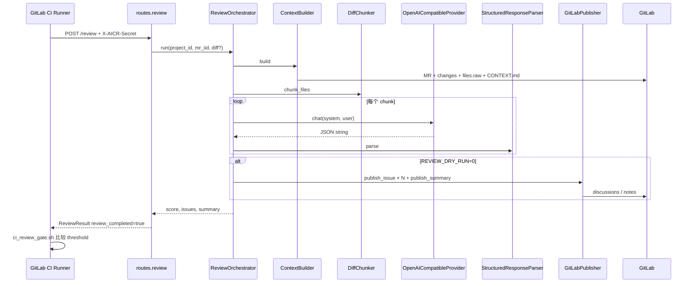

# AICR Reviewer 代码详细说明

本文档在 [ARCHITECTURE.md](ARCHITECTURE.md) 与 [LLM_CODE_REVIEW.md](LLM_CODE_REVIEW.md) 的基础上，从**源码层级**描述模块职责、类与函数、数据结构、控制流分支与异常路径。面向需要修改评审逻辑、接入新 LLM、或排查 CI/Webhook 行为的开发者。

**相关文档**

| 文档 | 侧重 |
|------|------|
| [ARCHITECTURE.md](ARCHITECTURE.md) | 组件关系、流水线概览、失败策略表 |
| [GITHUB_REFERENCES.md](GITHUB_REFERENCES.md) | **外部项目概念借鉴**（pr-agent / ai-pr-reviewer / reviewdog）与阶段 A/B/C 落点 |
| [PHASE_C.md](PHASE_C.md) | describe / CHANGELOG / 评论对话 / config.toml |
| [CI_REVIEW_PIPELINE.md](CI_REVIEW_PIPELINE.md) | CI 与 reviewdog → AICR 串联 |
| [LLM_CODE_REVIEW.md](LLM_CODE_REVIEW.md) | LLM 提示词、门禁语义、运维建议 |
| [SECRETS.md](SECRETS.md) | 环境变量与安全 |
| [aicr-reviewer/README.md](../aicr-reviewer/README.md) | 部署、API、本地启动 |

---

## 1. 源码树与包依赖

### 1.1 Monorepo 布局

```
/workspace                          # 仓库根（config 中 _MONOREPO_ROOT）
├── evn/.env                        # 推荐的环境变量（不提交密钥）
├── docs/                           # 架构、本文档、GITHUB_REFERENCES 等
├── evn/.aicr/config.toml.example   # 阶段 C 部署级 TOML 示例
├── aicr-reviewer/                  # FastAPI 应用根（uvicorn 工作目录）
│   ├── main.py                     # FastAPI app 工厂
│   ├── requirements.txt
│   ├── app/
│   │   ├── config.py               # 环境变量 + TOML 默认值
│   │   ├── config_toml.py          # 加载 evn/.aicr 与仓库 .aicr/config.toml
│   │   ├── config_resolver.py      # 按 MR 合并配置（ask 触发词、llm.*）
│   │   ├── exceptions.py
│   │   ├── api/routes.py           # /review、/describe、/changelog、webhook
│   │   ├── gitlab/
│   │   │   ├── client.py           # python-gitlab 单例
│   │   │   ├── context_builder.py  # MR → MRContext（含增量、project_config）
│   │   │   ├── publisher.py        # 行内评论 / 摘要 note
│   │   │   ├── mr_actions.py       # 更新 MR、changelog upsert、讨论回复
│   │   │   └── session.py          # GitLabMRSession、gitlab_call 重试
│   │   ├── tools/                  # 阶段 C：describe、changelog、ask
│   │   ├── llm/
│   │   │   ├── base.py             # LLMProvider Protocol
│   │   │   ├── factory.py          # create_llm_provider / create_llm_for_tool
│   │   │   └── openai_compat.py
│   │   ├── review/
│   │   │   ├── orchestrator.py     # 流水线主编排 + reflection + diff 过滤
│   │   │   ├── chunker.py          # tiktoken 分块
│   │   │   ├── diff_compress.py    # 阶段 A 压缩
│   │   │   ├── diff_line_index.py  # 阶段 B diff 内过滤
│   │   │   ├── reflection.py       # 阶段 B self-reflection
│   │   │   ├── score_utils.py      # 过滤后分数 reconcile
│   │   │   ├── review_state.py     # last_reviewed_sha、webhook 抑制
│   │   │   ├── language_priority.py
│   │   │   ├── token_utils.py
│   │   │   ├── parser.py
│   │   │   ├── prompt_renderer.py
│   │   │   └── prompts/*.j2        # system_*、describe、changelog、ask
│   │   └── utils/redact.py
│   └── scripts/
│       ├── ci_review_gate.sh       # CI 门禁（Runner 侧）
│       └── smoke_test.py           # 无 GitLab 的单元级冒烟
```

### 1.2 模块依赖方向（只允许向下依赖）



**约定**：业务代码不直接 `os.getenv`，统一 `from app.config import ...`。GitLab 客户端通过 `get_gitlab_client()` 单例获取，避免重复建连。

---

## 2. 应用入口：`main.py`

| 项 | 说明 |
|----|------|
| 框架 | FastAPI |
| 版本 | `2.0.0`（`app` 元数据） |
| 路由挂载 | `app.include_router(router)`，`router` 来自 `app.api.routes`（无 URL 前缀） |
| 日志 | `logging.basicConfig(level=INFO)`，logger 名多为 `aicr` |

启动示例（工作目录必须为 `aicr-reviewer/`）：

```bash
python -m uvicorn main:app --host 0.0.0.0 --port 8001 --reload
```

`import main` 时会间接加载 `app.config`（执行 `_load_env_files()`），因此**在 import 任何 `app.*` 之前**应已存在 `evn/.env` 或等价文件。

---

## 3. 配置层：`app/config.py`

### 3.1 加载时机与顺序

模块顶层调用 `_load_env_files()`，对以下路径依次 `load_dotenv(path, override=False)`：

1. `<repo>/evn/.env`
2. `<repo>/.env`
3. `aicr-reviewer/.env`

`override=False` 表示：**先被加载的变量优先**；后出现的文件不会覆盖已存在的环境变量。

`_MONOREPO_ROOT` 计算方式：`Path(__file__).resolve().parents[2]`（`app/config.py` → `app` → `aicr-reviewer` → 仓库根）。

### 3.2 导出常量一览

| 常量 | 环境变量 | 默认值 | 使用方 |
|------|----------|--------|--------|
| `GITLAB_URL` | `GITLAB_URL` | `http://localhost:8000` | `client.py` |
| `AICR_BOT_TOKEN` | `AICR_BOT_TOKEN` | `""` | GitLab 客户端；`/review` 未配置时 500 |
| `SCORE_THRESHOLD` | `AICR_SCORE_THRESHOLD` | `60` | `publisher.publish_summary`、与 CI 脚本一致 |
| `REVIEW_API_SECRET` | `REVIEW_API_SECRET` | `""` | `/review` 鉴权；空则跳过 |
| `LLM_PROVIDER` | `LLM_PROVIDER` | `ctyun_openai` | `factory.py` |
| `LLM_API_BASE` | `LLM_API_BASE` | 天翼预设 URL | 可覆盖 preset |
| `LLM_API_KEY` | `LLM_API_KEY` | `""` | 必填（factory 校验） |
| `LLM_MODEL` | `LLM_MODEL` | `""` | 必填 |
| `LLM_TIMEOUT_SECONDS` | `LLM_TIMEOUT_SECONDS` | `120` | OpenAI 客户端 |
| `LLM_MAX_TOKENS` | `LLM_MAX_TOKENS` | `4096` | completion 上限 |
| `LLM_TEMPERATURE` | `LLM_TEMPERATURE` | `0.2` | 偏低以利 JSON 稳定 |
| `REVIEW_MAX_INPUT_TOKENS` | `REVIEW_MAX_INPUT_TOKENS` | `12000` | `DiffChunker` |
| `CONTEXT_MAX_CHARS` | `CONTEXT_MAX_CHARS` | `8000` | `.llm/CONTEXT.md` 截断 |
| `REVIEW_DRY_RUN` | `REVIEW_DRY_RUN` | `0`（`1` 为真） | 跳过 `GitLabPublisher` |
| `GITLAB_WEBHOOK_SECRET` | `GITLAB_WEBHOOK_SECRET` | `""` | Webhook 校验 |
| `GITLAB_WEBHOOK_ALLOW_INSECURE` | `GITLAB_WEBHOOK_ALLOW_INSECURE` | `0` | 无 secret 时是否允许 |

---

## 4. 异常体系：`app/exceptions.py`

```text
Exception
└── ReviewError                    # 评审失败基类
    ├── LLMReviewError             # LLM 调用或解析失败
    └── NoReviewableChangesError   # 无支持扩展名的可审变更
```

| 异常 | 抛出位置 | API 层处理 | `review_completed` | `score` |
|------|----------|------------|----------------------|---------|
| `NoReviewableChangesError` | `orchestrator.run`（chunks 为空） | `routes.review` 专用分支 | `false` | `100` |
| `LLMReviewError` | 全部分块 LLM 失败；或 `_review_chunk` 包装 | `_fail_open_review` | `false` | `100` |
| `ReviewError` | 其它继承（当前较少直接抛） | `_fail_open_review` | `false` | `100` |
| `HTTPException` | `_run_orchestrator`（token/LLM 未配置） | `_fail_open_review` | `false` | `100` |
| 任意 `Exception` | 未预期错误 | `_fail_open_review` + `exc_info` | `false` | `100` |

注意：`exceptions.py` 注释写 `ReviewError`「不应作为 score=100」，但 **`routes.py` 将 `ReviewError` 与 `LLMReviewError` 一并 fail-open**。实际行为以 `routes.py` 为准。

---

## 5. HTTP 层：`app/api/routes.py`

### 5.1 数据模型（Pydantic）

**`ReviewRequest`**

| 字段 | 类型 | 默认 | 含义 |
|------|------|------|------|
| `project_id` | `int` | 必填 | GitLab 项目 ID |
| `mr_iid` | `int` | 必填 | MR 内部 IID（`!123` 中的 123） |
| `diff` | `str` | `""` | CI 注入的额外 patch，见 `ContextBuilder.build(extra_diff)` |

**`ReviewResult`**

| 字段 | 类型 | 默认 | 含义 |
|------|------|------|------|
| `score` | `float` | — | 0–100；fail-open 时为 **100** |
| `issues` | `List[Dict]` | — | 结构化问题 |
| `code_quality` | `List[Dict]` | `[]` | Code Climate 风格，供工具链 |
| `summary` | `str` | `""` | 人类可读摘要 |
| `review_completed` | `bool` | `False` | **CI 门禁唯一可信标志** |

常量：`FAIL_OPEN_SCORE = 100.0`。

### 5.2 `GET /health`

无鉴权。返回运行态探测字段（不调用 GitLab/LLM）：

- `status`: `"ok"`
- `gitlab_url`, `token_set`, `llm_provider`, `llm_model`, `llm_key_set`, `review_auth_required`

### 5.3 `POST /review` — 完整决策树



**鉴权 `_verify_review_auth`**

1. `REVIEW_API_SECRET` 为空 → **直接通过**（本地开发）。
2. 否则读取 `X-AICR-Secret`；若空则解析 `Authorization: Bearer <token>`。
3. 不匹配 → `HTTPException(401)`；**注意**：`review()` 捕获后 **不返回 401**，而是 `_fail_open_review`（fail-open）。

**`_run_orchestrator`**

1. `AICR_BOT_TOKEN` 空 → `HTTPException(500)` → 上层 fail-open。
2. `create_llm_provider()` → `ValueError` → `HTTPException(503)` → fail-open。
3. 构造 `ReviewOrchestrator(ContextBuilder(), llm, GitLabPublisher())`。
4. 调用 `orchestrator.run(project_id, mr_iid, extra_diff)`。

### 5.4 `POST /webhook/gitlab` — 分支说明

与 `/review` 不同：**鉴权失败返回真实 401/503**，不 fail-open（Webhook 由 GitLab 重试，不阻塞 MR 合并）。

| 步骤 | 条件 | 响应 |
|------|------|------|
| Secret | 未配置且 `GITLAB_WEBHOOK_ALLOW_INSECURE=0` | **503** |
| Secret | 已配置但 `X-Gitlab-Token` 不匹配 | **401** |
| 事件类型 | `object_kind != "merge_request"` | 200 `ignored` |
| MR 动作 | `action` 不在 `open`,`update`,`reopen` | 200 `ignored` |
| 参数 | 缺 `project.id` 或 `object_attributes.iid` | 200 `ignored` |
| 成功受理 | 以上均通过 | 200 `accepted` + BackgroundTasks |

后台任务 `_run_review()`：

- 调用 `_run_orchestrator`（与同步 `/review` 相同逻辑）。
- **任意异常仅打日志**，不向 GitLab 返回错误（HTTP 已结束）。

---

## 6. GitLab 集成层

### 6.1 `app/gitlab/client.py`

```python
_gl_instance: Optional[gitlab.Gitlab] = None

def get_gitlab_client() -> gitlab.Gitlab:
    # 懒加载单例：Gitlab(GITLAB_URL, private_token=AICR_BOT_TOKEN)
```

全进程共享一个 `python-gitlab` 实例；**非线程安全重建**（Cloud 部署通常单 worker 或可接受）。

### 6.2 `MRContext` 与 `ContextBuilder`

#### `MRContext`（`__slots__` 数据载体）

| 属性 | 类型 | 来源 |
|------|------|------|
| `project_id`, `mr_iid` | `int` | 参数 |
| `title`, `description` | `str` | `mr.title`, `mr.description` |
| `source_branch`, `target_branch` | `str` | MR API |
| `diff_refs` | `dict \| None` | `mr.diff_refs`（行内评论必需） |
| `changes` | `list` | `mr.changes()["changes"]` |
| `context_md` | `str` | `.llm/CONTEXT.md` 或默认 Spring 文案 |
| `changed_files` | `list[dict]` | 见下表 |

#### `changed_files` 每项结构

| 键 | 说明 |
|----|------|
| `old_path`, `new_path` | GitLab change 对象 |
| `diff` | unified diff 字符串 |
| `content` | 源分支完整文件（UTF-8，`errors=ignore`） |
| `is_supported` | 路径是否以 `SUPPORTED_EXTENSIONS` 结尾 |

**`SUPPORTED_EXTENSIONS`（模块级常量）**

```text
.java, .kt, .xml, .yml, .yaml, .properties,
.py, .js, .ts, .go, .rs, .sql,
.dockerfile, .gradle, .toml
```

#### `build()` 执行顺序



**`_load_context_md` 分支**

1. 依次尝试 `ref = source_branch`、`target_branch`。
2. 读取 `.llm/CONTEXT.md`；超长则截断至 `CONTEXT_MAX_CHARS` 并 `warning` 日志。
3. 两分支均失败 → `_default_context()`（内置 Spring Boot/Cloud 约定列表）。

**`extra_diff`（CI 注入）**

在 `changed_files` **头部**插入：

```python
{
  "old_path": "",
  "new_path": "_ci_extra_diff.patch",
  "diff": extra_diff,
  "content": "",
  "is_supported": True,
}
```

用于 Runner 侧附带 CI 生成补丁而 GitLab changes API 未包含的场景。

### 6.3 `GitLabPublisher`

#### 实例状态

- `_seen: set` — 本批次已发布 fingerprint（`publish_issue` 生命周期 = 单次 `ReviewOrchestrator.run` 内新建 Publisher）。

#### `publish_issue` 分支



**行内 `_post_inline` position 结构**

```python
{
  "base_sha": diff_refs["base_sha"],
  "start_sha": diff_refs["start_sha"],
  "head_sha": diff_refs["head_sha"],
  "position_type": "text",
  "new_path": file_path,
  "new_line": new_line,
}
```

模型若给出不在 MR diff 范围内的行号，GitLab API 失败 → 自动 Note 回退。

#### `publish_summary`

- `status = "PASSED" if score >= threshold else "FAILED"`
- 通过 `mr.notes.create` 发布 Markdown 摘要（分数、阈值、issue 数、summary 正文）。

---

## 7. LLM 层（深入）

`app/llm/` 是评审流水线中**唯一**与外部大模型 API 通信的包。上游由 `ReviewOrchestrator._review_chunk` 组装 `messages`；下游将返回字符串交给 `StructuredResponseParser`。本层**不**解析 JSON、**不**访问 GitLab。

更偏产品与提示词视角的说明见 [LLM_CODE_REVIEW.md](LLM_CODE_REVIEW.md)；本章聚焦**源码行为、请求形态、错误传播与扩展方式**。

### 7.0 在流水线中的位置



| 阶段 | 负责模块 | 与 LLM 的关系 |
|------|----------|----------------|
| 分块预算 | `review/chunker.py` + `REVIEW_MAX_INPUT_TOKENS` | 限制 **prompt 侧** 字符量（约 4 字符/token） |
| 脱敏 | `utils/redact.py` | 仅作用于送入 user 的 `diff_text`；`context_md` 在 `ContextBuilder` 已脱敏 |
| 渲染 | `review/prompt_renderer.py` | 产出 system/user 字符串，**不**调用 LLM |
| 调用 | `llm/openai_compat.py` | `POST` Chat Completions（经 `openai` SDK） |
| 输出上限 | `LLM_MAX_TOKENS` | 限制 **completion** token 上限，与输入分块无关 |
| 解析 | `review/parser.py` | 将 `chat()` 返回值变为 `{score, summary, issues}` |

### 7.1 生命周期：何时创建、复用几次

```text
POST /review 或 Webhook 后台任务
  → routes._run_orchestrator()
       → create_llm_provider()          # 每次评审请求新建一个 Provider
       → ReviewOrchestrator(..., llm_provider=llm)
            → run() 循环每个 chunk
                 → _review_chunk() → llm.chat()   # 每块 1 次 HTTP（可能 +1 次 json 降级重试）
```

| 对象 | 作用域 | 说明 |
|------|--------|------|
| `OpenAI` SDK `client` | 单次 `create_llm_provider()` 内 | 构造于 `OpenAICompatibleProvider.__init__` |
| `OpenAICompatibleProvider` | 单次 `orchestrator.run()` | 同一 MR 评审的多个 chunk **共用** 同一实例 |
| HTTP 连接 | SDK 内部池化 | 无应用层显式连接池配置 |

**未实现**：跨请求 Provider 缓存、流式 `stream=True`、并发多 chunk 调用。

### 7.2 `LLMProvider` 协议（`app/llm/base.py`）

使用 `typing.Protocol`（结构化子类型），**不要求**实现类显式 `inherit LLMProvider`。当前唯一生产实现为 `OpenAICompatibleProvider`；测试可用 `unittest.mock.MagicMock`。

```python
class LLMProvider(Protocol):
    def chat(
        self,
        messages: List[Dict[str, str]],
        *,
        json_mode: bool = True,
        max_tokens: Optional[int] = None,
        temperature: Optional[float] = None,
    ) -> str: ...
```

| 参数 | 生产调用方是否传入 | 说明 |
|------|-------------------|------|
| `messages` | 是 | 固定 2 条：`system` + `user`，见 §7.6 |
| `json_mode` | 是，恒为 `True` | 触发 `response_format: json_object` 及降级逻辑 |
| `max_tokens` | **否** | 始终用实例构造时的 `self.max_tokens`（来自 `LLM_MAX_TOKENS`） |
| `temperature` | **否** | 始终用 `self.temperature`（来自 `LLM_TEMPERATURE`） |

**契约**：`json_mode=True` 时，返回值应为可被 `StructuredResponseParser` 解析的 JSON 文本（允许外包 markdown 代码块）；协议层**不**校验内容。

### 7.3 工厂：`create_llm_provider`（`factory.py`）

#### 7.3.1 预设表 `_PROVIDER_MAP`

| `LLM_PROVIDER` | `preset["api_base"]` | 典型 `LLM_MODEL` 示例 |
|----------------|----------------------|------------------------|
| `ctyun_openai` | `https://wishub-x6.ctyun.cn/v1` | 按天翼文档填写 |
| `deepseek` | `https://api.deepseek.com/v1` | `deepseek-chat` |
| `zhipu` | `https://open.bigmodel.cn/api/paas/v4` | `glm-4` 等 |
| `openai` | `https://api.openai.com/v1` | `gpt-4o-mini` 等 |
| *未知名* | `{}`（无 preset） | 必须自行配置 `LLM_API_BASE` |

#### 7.3.2 `api_base` 解析（含易错点）

源码逻辑：

```python
preset = _PROVIDER_MAP.get(provider, {})
api_base = LLM_API_BASE or preset.get("api_base", "")
```

而 `app/config.py` 中：

```python
LLM_API_BASE = os.getenv("LLM_API_BASE", "https://wishub-x6.ctyun.cn/v1")
```

因此只要环境变量**未显式设置** `LLM_API_BASE`，模块加载后 `LLM_API_BASE` **恒为非空字符串**，`preset["api_base"]` **永远不会被采用**。

| 场景 | 实际请求的 `base_url` |
|------|-------------------------|
| 仅设 `LLM_PROVIDER=deepseek`，未改 `LLM_API_BASE` | 仍为默认天翼 URL（**常见配置错误**） |
| `LLM_PROVIDER=deepseek` 且 `LLM_API_BASE=https://api.deepseek.com/v1` | DeepSeek |
| 自建网关 | `LLM_API_BASE=https://your-gateway/v1` |
| 未知 provider + 自定义 base | 仅 `LLM_API_BASE` 有效 |

**推荐做法**：切换厂商时**同时**修改 `LLM_PROVIDER`、`LLM_API_BASE`、`LLM_MODEL`、`LLM_API_KEY` 四套变量，并以 `/health` 的 `llm_provider` / `llm_model` 与日志 `Creating LLM provider: ... base=...` 核对。

#### 7.3.3 工厂校验与失败路径



`routes._run_orchestrator` 将 `ValueError` 转为 `HTTPException(503, "LLM provider not configured")`，`/review` 再 **fail-open**（不拦 MR）。

### 7.4 `OpenAICompatibleProvider` 实现（`openai_compat.py`）

#### 7.4.1 构造与 HTTP 客户端

```python
self.client = OpenAI(
    base_url=api_base,           # 兼容任意 OpenAI Chat Completions 网关
    api_key=api_key,
    timeout=timeout,               # LLM_TIMEOUT_SECONDS，整次请求上限（秒）
    default_headers={"User-Agent": "aicr-reviewer/1.0"},
)
```

| 实例属性 | 来源 | 用途 |
|----------|------|------|
| `self.model` | `LLM_MODEL` | 请求体 `model` |
| `self.max_tokens` | `LLM_MAX_TOKENS` | 请求体 `max_tokens` |
| `self.temperature` | `LLM_TEMPERATURE` | 请求体 `temperature` |

依赖：`openai>=1.0.0`（见 `requirements.txt`），使用 **同步** `chat.completions.create`，无 async。

#### 7.4.2 实际 HTTP 请求体（`chat` → `_complete`）

每次 `_complete` 调用等价于向 `{api_base}/chat/completions` 发送 JSON，核心字段：

```json
{
  "model": "<LLM_MODEL>",
  "messages": [
    { "role": "system", "content": "<system_prompt 全文>" },
    { "role": "user", "content": "<user_prompt 全文 + 可选 chunk 注记>" }
  ],
  "max_tokens": 4096,
  "temperature": 0.2,
  "response_format": { "type": "json_object" }
}
```

最后一项**仅**在 `json_mode=True` 的首次尝试时附带；降级重试时去掉 `response_format`。

**未发送的 OpenAI 参数**（当前实现无）：`top_p`、`frequency_penalty`、`presence_penalty`、`seed`、`tools`、`stop`、`n>1`、logprobs 等。

#### 7.4.3 `chat()` 控制流（含重试语义）



| 行为 | 说明 |
|------|------|
| 最多 HTTP 次数 | `json_mode=True` 时 **1 或 2** 次；`False` 时 1 次 |
| 重试条件 | 仅当异常字符串匹配 `_json_mode_unsupported` |
| 不重试的情况 | 401/403、超时、429、网络断开、模型不存在等 → 直接失败 |
| 空 content | `choices[0].message.content or ""` → 空串交给 parser，通常 `ParseError` |

**`_json_mode_unsupported(exc)`** 对 `str(exc).lower()` 做子串匹配，命中任一即降级：

- `response_format`
- `json_object`
- `unsupported`

注意：若厂商返回 **HTTP 200 但 JSON 非结构化**（未报错却未遵守 schema），**不会**触发第二次请求，由 `parser` 兜底或失败。

#### 7.4.4 响应处理与可观测性

```python
resp = self.client.chat.completions.create(**kwargs)
content = resp.choices[0].message.content or ""
# usage 若存在则 INFO 日志：prompt_tokens, completion_tokens, total_tokens
```

| 日志（logger=`aicr`） | 时机 |
|------------------------|------|
| `LLM request: model=..., messages=2, json_mode=...` | 每次 `chat` 入口 |
| `json_mode unsupported, retrying without response_format` | 降级重试前 |
| `LLM usage: prompt=..., completion=..., total=...` | API 返回 `usage` 时 |
| `Creating LLM provider: {provider}, base=..., model=...` | 工厂创建时 |

**未记录**：完整 prompt/response 正文（避免泄露代码与密钥）；需在网关侧或临时加 debug 日志排查。

### 7.5 两套 Token 预算（易混淆）

| 环境变量 | 默认值 | 作用域 | 实现位置 |
|----------|--------|--------|----------|
| `REVIEW_MAX_INPUT_TOKENS` | `12000` | 每个 **chunk** 的 diff+全文 **输入** 估算 | `DiffChunker`：`max_chars = tokens × 4` |
| `LLM_MAX_TOKENS` | `4096` | 单次 completion **输出** 上限 | `OpenAICompatibleProvider._complete` |

```text
一次 _review_chunk 的「输入体量」受 REVIEW_MAX_INPUT_TOKENS 约束
一次 chat() 的「输出长度」受 LLM_MAX_TOKENS 约束

若 issues 很多、summary 很长，可能出现：
  - completion 被截断 → JSON 不完整 → ParseError → 该 chunk 记为 LLM 失败
```

**粗算单次 MR 成本（调用次数）**：

```text
LLM 调用次数 ≈ chunk 数量 × (1 或 2，若发生 json 降级)
总 prompt 体量 ≈ Σ 每块 (len(system) + len(user))
  其中 system 含完整 context_md（每块重复发送，无缓存）
```

大 MR、多 chunk 时 **system 提示（含 `.llm/CONTEXT.md`）会对每块重复计费**——优化成本可考虑缩短 `CONTEXT.md` 或后续做 prompt 缓存（当前未实现）。

### 7.6 与 `ReviewOrchestrator._review_chunk` 的衔接

#### 7.6.1 `messages` 组装（生产路径唯一调用点）

```107:110:aicr-reviewer/app/review/orchestrator.py
        messages = [
            {"role": "system", "content": system_prompt},
            {"role": "user", "content": user_prompt},
        ]
```

| 消息 | 内容来源 | 体量主要因素 |
|------|----------|--------------|
| `system` | `PromptRenderer.render_system(context_md=ctx.context_md, language_hint="Java/Spring")` | `CONTEXT_MAX_CHARS` 截断后的团队规范 + 固定 Spring 检查清单 |
| `user` | `render_user(mr_title, mr_description, changed_files_summary, diff_text)` + `chunk_note` | 当前 chunk 内文件的 unified diff + 可选全文 |

`diff_text` 生成顺序：`_build_diff_text(chunk["files"])` → `redact_secrets()`。

多块时 `chunk_note` 示例：

```text

Note: chunk 2/3. Review only the files shown.
```

#### 7.6.2 调用与异常包装

```112:120:aicr-reviewer/app/review/orchestrator.py
        try:
            raw = self.llm.chat(messages, json_mode=True)
        except Exception as e:
            raise LLMReviewError(f"LLM call failed: {e}") from e

        try:
            return self.parser.parse(raw)
        except ParseError as e:
            raise LLMReviewError(f"LLM response parse failed: {e}") from e
```

| 失败类型 | 异常类 | 在 `run()` 中 |
|----------|--------|---------------|
| SDK/网络/HTTP/超时 | `LLMReviewError("LLM call failed: ...")` | `llm_failures` += 1，`continue` |
| 返回无法解析 | `LLMReviewError("LLM response parse failed: ...")` | 同上 |
| 全部 chunk 失败 | `LLMReviewError` 合并消息 | 抛至 `routes` → fail-open |
| 部分 chunk 失败 | 不抛 | `summary` 追加 `Partial LLM failures: ...` |

**重要**：解析失败与 HTTP 失败在编排层**同等对待**，均视为该 chunk 的 LLM 失败。

### 7.7 与 `StructuredResponseParser` 的契约

LLM 层只保证返回 `str`；下列由 parser 完成（详见 §10）：

| 步骤 | 行为 |
|------|------|
| 去 markdown 围栏 | `` ```json ... ``` `` |
| `json.loads` | 失败则正则抽取含 `"score"` 与 `"issues"` 的对象 |
| `_normalize` | `score` 钳制 0–100；issue 字段补默认 |

期望的**逻辑 schema**（由 `system_spring.j2` 约束，非 JSON Schema 校验）：

```json
{
  "score": 0,
  "summary": "string",
  "issues": [
    {
      "file": "path/from/repo/root",
      "line": 0,
      "severity": "critical|major|minor|info",
      "category": "null_safety|security|...",
      "message": "string",
      "suggestion": "string"
    }
  ]
}
```

`json_object` 模式仅提高 JSON 语法合法概率；**字段名错误、缺字段**仍靠 `_normalize` 默认值，**不会**触发 LLM 重试。

### 7.8 LLM 相关失败传播总表

| 触发点 | 异常/结果 | `/review` HTTP | `review_completed` | GitLab 评论 |
|--------|-----------|----------------|-------------------|-------------|
| 工厂 `ValueError` | 503 → fail-open | 200 | `false` | 无 |
| 单 chunk `chat` 失败 | 记入 `llm_failures` | — | — | — |
| 单 chunk `parse` 失败 | 同上 | — | — | — |
| 全部 chunk 失败 | `LLMReviewError` | 200 | `false` | 无 |
| 部分 chunk 成功 | 聚合成功块 | 200 | `true` | 发布成功块的 issues |
| 全部 chunk 成功 | 正常 return | 200 | `true` | 全部发布 |

Webhook 路径：LLM 失败仅写 error 日志，**不改变** 已返回的 `accepted` 响应。

### 7.9 扩展：新增 Provider 实现

**方式 A — 仍走 OpenAI 兼容网关（推荐）**

1. 在 `evn/.env` 设置 `LLM_API_BASE`、`LLM_MODEL`、`LLM_API_KEY`。
2. 可选：在 `_PROVIDER_MAP` 增加预设名，避免 base 写错。
3. 确认网关支持 Chat Completions；若不支持 `json_object`，依赖 §7.4.3 自动降级 + parser 兜底。

**方式 B — 非 OpenAI 协议（需改代码）**

1. 新建 `app/llm/your_provider.py`，实现与 `LLMProvider` 相同的 `chat(...)` 签名。
2. 修改 `factory.create_llm_provider` 按配置分支返回新类。
3. 在 `smoke_test.py` 增加 Mock 或集成测试。

**方式 C — 调整调用参数**

-  per-request 温度/输出长度：在 `orchestrator._review_chunk` 传入 `self.llm.chat(..., max_tokens=N, temperature=T)`（需改调用方；协议已支持）。
-  关闭 JSON 模式：`json_mode=False`（不推荐，解析失败率上升）。

### 7.10 测试与本地 Mock

`smoke_test.py` 中的 LLM 相关用例：

| 测试 | 手法 | 断言 |
|------|------|------|
| `test_llm_failure_raises` | `llm.chat.side_effect = RuntimeError` | `orchestrator.run` → `LLMReviewError` |
| `test_review_fail_open` | patch `_run_orchestrator` 抛 `LLMReviewError` | API `review_completed=false`, `score=100` |

**单元测试 Parser 不经过真实 LLM**（`test_parser` 直接喂 JSON 字符串）。

手动 Mock 示例：

```python
from unittest.mock import MagicMock

llm = MagicMock()
llm.chat.return_value = '{"score": 80, "summary": "ok", "issues": []}'
orch = ReviewOrchestrator(ctx_builder, llm, publisher)
```

### 7.11 配置速查与 `/health` 对照

| 变量 | `/health` 字段 | 说明 |
|------|----------------|------|
| `LLM_PROVIDER` | `llm_provider` | 仅展示，不参与 base 解析 |
| `LLM_MODEL` | `llm_model` | |
| `LLM_API_KEY` | `llm_key_set` | 布尔，不暴露密钥 |
| — | 无 | `LLM_API_BASE` / 超时 / `LLM_MAX_TOKENS` 未在 health 暴露 |

生产排障建议顺序：

1. `GET /health` 确认 `llm_key_set=true`、模型名预期。
2. 查日志 `Creating LLM provider` 的 `base=` 是否与厂商一致（§7.3.2）。
3. 查 `LLM request` / `LLM usage` 是否出现；无 usage 可能是请求未到达或厂商不返回 usage。
4. 若 `LLM response parse failed` 增多，抓一条原始 `raw`（临时日志）看是否截断或非 JSON。

### 7.12 源码索引（LLM 包）

| 符号 | 文件 | 说明 |
|------|------|------|
| `LLMProvider` | `base.py` | Protocol |
| `create_llm_provider` | `factory.py` | 工厂入口 |
| `_PROVIDER_MAP` | `factory.py` | 厂商 preset |
| `OpenAICompatibleProvider` | `openai_compat.py` | 生产实现 |
| `.chat` / `._complete` / `._json_mode_unsupported` | `openai_compat.py` | 请求与降级 |
| 调用方 `llm.chat` | `orchestrator.py` | `_review_chunk` |
| 工厂调用方 | `routes.py` | `_run_orchestrator` |

---

## 8. 评审核心：`ReviewOrchestrator`

文件：`app/review/orchestrator.py`。这是**业务主路径**，建议修改行为时从此读起。

### 8.1 依赖注入（构造函数）

| 参数 | 默认实现 | 职责 |
|------|----------|------|
| `context_builder` | `ContextBuilder()` | 构建 `MRContext` |
| `llm_provider` | `create_llm_provider()` | 每块一次 `chat` |
| `publisher` | `GitLabPublisher()` | 非 dry-run 时写 GitLab |

内部固定创建：`DiffChunker()`、`PromptRenderer()`、`StructuredResponseParser()`。

### 8.2 `run()` 主流程（逐步）

| 步骤 | 代码 | 分支/说明 |
|------|------|-----------|
| 1 | `ctx = context_builder.build(...)` | GitLab 网络/API 错误 → 未捕获则 API Exception fail-open |
| 2 | `chunks = chunker.chunk_files(ctx.changed_files)` | 仅 `is_supported=True` 的文件 |
| 3 | `if not chunks` | `raise NoReviewableChangesError` |
| 4 | 循环 `chunks` | 每块 `_review_chunk` |
| 4a | `_review_chunk` 抛 `LLMReviewError` | 记入 `llm_failures`，**continue**（不中断其它块） |
| 4b | 成功 | 合并 `issues`；`min_score = min(min_score, chunk_score)`；拼接 `summary` |
| 5 | `len(llm_failures) == len(chunks)` | `raise LLMReviewError`（全部失败） |
| 5a | 部分失败 | `summary` 追加 `Partial LLM failures: ...` |
| 6 | `if not REVIEW_DRY_RUN` | `_publish_results` |
| 7 | return dict | `score`, `summary`, `issues`, `code_quality` |

**聚合语义（关键）**

- **分数**：各块 `score` 的 **最小值**（任一块严重问题拉低总分）。
- **issues**：简单 `extend` 合并，**不去重**（去重在 Publisher fingerprint）。
- **summary**：块 summary 用 `" | "` 连接。

### 8.3 `_review_chunk()` 详解

| 阶段 | 操作 |
|------|------|
| System 提示 | `renderer.render_system(context_md=ctx.context_md, language_hint="Java/Spring")` |
| User 摘要 | `_files_summary(chunk["files"])` → markdown 列表 ``- `path` `` |
| Diff 正文 | `_build_diff_text` → `redact_secrets` |
| 分块注记 | `total_chunks > 1` 时追加英文 Note |
| LLM | `messages = [system, user]`；`llm.chat(..., json_mode=True)`（详见 **§7.6–§7.7**） |
| 解析 | `parser.parse(raw)`；`ParseError` → 包装为 `LLMReviewError` |

**`_build_diff_text` 单文件格式**

```text
diff --git a/{path} b/{path}
{diff_body}

# Full file: {path}
{content}          # 若 content 非空
```

多块之间用 `\n\n` 连接。

### 8.4 `_publish_results()` 与 `code_quality`

每条 issue 发布 body：

```markdown
**AICR 评审** ({severity}/{category})

{message}

**建议**: {suggestion}   # 仅 suggestion 非空时
```

`_build_code_quality` 将 issue 转为 Code Climate 风格：

```python
{
  "description": message,
  "check_name": "aicr-review",
  "fingerprint": "{file}:{line}:{category}",
  "severity": severity,
  "location": {"path": file, "lines": {"begin": line or 1}},
}
```

---

## 9. 分块器：`DiffChunker`

### 9.1 预算计算

```text
max_chars = REVIEW_MAX_INPUT_TOKENS * 4   # APPROX_CHARS_PER_TOKEN
```

默认 `12000 * 4 = 48000` 字符/块。

### 9.2 `chunk_files` 算法（贪心装箱）

```text
对每个 is_supported 文件 f:
  file_entry = _maybe_truncate_file(f, max_chars)
  file_chars = len(_file_text(file_entry))

  若 current_chars + file_chars > max_chars 且 current_files 非空:
      封存当前 chunk，开启新 chunk

  将 file_entry 加入当前 chunk
```

**注意**：超大单文件先 `_maybe_truncate_file`，仍可能单独占满一块；截断后 `content` 被清空，仅保留截断后的 `diff`。

### 9.3 `_maybe_truncate_file`

当 `len(_file_text(f)) > max_chars`：

- `diff` 截取前 `max_chars` 并追加 `\n... [truncated for token budget]`
- `content` 置 `""`

### 9.4 `_file_text`（计费用文本）

```text
--- {old_path}
+++ {new_path}
{diff}
# Full file content:
{content}
```

---

## 10. 解析器：`StructuredResponseParser`

### 10.1 `parse(raw)` 管道

1. `strip`
2. 若以 `` ``` `` 开头：剥掉 `` ```json `` 与结尾 `` ``` ``
3. `json.loads`；失败 → `_extract_json`
4. `_normalize(data)`

### 10.2 `_extract_json` 正则策略

按顺序尝试模式：

1. `\{[\s\S]*"score"[\s\S]*"issues"[\s\S]*\}`
2. `\{[\s\S]*\}`（最宽）

对每个 match 尝试 `json.loads`，首个成功即返回。

### 10.3 `_normalize` 输出契约

| 字段 | 规则 |
|------|------|
| `score` | `float`，钳制 `[0, 100]` |
| `summary` | `str(data.get("summary", ""))` |
| `issues[]` | 仅保留 `dict` 项；字段默认见下 |

**issue 项默认值**

| 键 | 默认 |
|----|------|
| `file` | `""` |
| `line` | `_safe_line` → `max(0, int(...))`，非法为 0 |
| `severity` | `"info"` |
| `category` | `"other"` |
| `message`, `suggestion` | `""` |

---

## 11. 提示词：`PromptRenderer` 与模板

### 11.1 Jinja2 环境

- 目录：`app/review/prompts/`
- `FileSystemLoader` + `select_autoescape`（字符串模板默认不转义 HTML）

模块级单例 `_env`，模板加载一次。

### 11.2 `system_spring.j2` 结构

1. 角色：`senior code reviewer`，`language_hint` 插值（当前固定 `"Java/Spring"`）
2. 检查维度：Correctness、Spring、Spring Cloud、API、Performance、Configuration
3. 分数档位说明（90–100 … 0–29）
4. **强制 JSON Schema**（score、summary、issues 字段说明）
5. 规则：只报真实问题；每项需 file+line；severity 定义
6. 若 `context_md` 非空：插入 `## Project-Specific Context`

### 11.3 `user_review.j2` 结构

- MR 标题、可选描述
- Changed Files 列表（markdown）
- 代码块包裹 `diff_text`
- 末行：要求 JSON 输出

### 11.4 扩展提示词

- 新增 `system_xxx.j2` 后，在 `PromptRenderer.render_system` 中切换 `get_template` 名或增加参数。
- `language_hint` 仅影响 system 首段描述，**不自动切换检查规则**（规则写在模板内）。

---

## 12. 脱敏：`app/utils/redact.py`

| 模式 | 替换 |
|------|------|
| `(password\|secret\|api_key\|token)\s*[:=]\s*\S+`（忽略大小写） | `\1=***REDACTED***` |
| `glpat-[A-Za-z0-9._-]+` | `glpat-***REDACTED***` |
| `AKIA[0-9A-Z]{16}` | `AKIA***REDACTED***` |

调用点：

- `ContextBuilder.build` → `context_md`
- `ReviewOrchestrator._review_chunk` → `diff_text`（**不**对 system 中的 context_md 二次脱敏，context 已在 build 时脱敏）

---

## 13. CI 门禁脚本：`scripts/ci_review_gate.sh`

**设计原则**：与服务端 fail-open 对称——**只有明确「评审完成且低分」才 `exit 1`**。



环境变量：

- `AICR_REVIEW_URL`（必需）
- `AICR_REVIEW_SECRET` → `X-AICR-Secret`
- `AICR_SCORE_THRESHOLD`（默认 60）
- `AICR_REVIEW_TIMEOUT`（curl `-m`，默认 300 秒）

---

## 14. 端到端时序（CI 同步路径）



---

## 15. 状态与标志位速查

| 场景 | HTTP | `review_completed` | `score` | GitLab 评论 | CI job |
|------|------|-------------------|---------|-------------|--------|
| 评审成功，分数达标 | 200 | `true` | 实际值 | 已发布（非 dry-run） | 通过 |
| 评审成功，分数低于阈值 | 200 | `true` | 实际值 | 已发布 | **失败** |
| 无可审文件 | 200 | `false` | 100 | 无 | 通过 |
| LLM 全失败 | 200 | `false` | 100 | 无 | 通过 |
| LLM 部分失败 | 200 | `true` | 各块 min | 已发布（基于成功块） | 按分数 |
| 鉴权失败（/review） | 200 | `false` | 100 | 无 | 通过 |
| Webhook 受理 | 200 | N/A（异步） | N/A | 后台可能发布 | N/A |
| `REVIEW_DRY_RUN=1` | 200 | `true`（若成功） | 实际值 | **跳过** | 按分数 |

---

## 16. 冒烟测试覆盖（`scripts/smoke_test.py`）

| 函数 | 验证点 |
|------|--------|
| `test_parser` | 正常 JSON；非法 line；纯文本 → `ParseError` |
| `test_chunker_truncation` | 超大 diff 出现 `[truncated` |
| `test_empty_chunks` | 仅不支持扩展名 → `NoReviewableChangesError` |
| `test_llm_failure_raises` | 全块 LLM 失败 → `LLMReviewError` |
| `test_redact` | 密码与 glpat 被替换 |
| `test_health_import` | `main.app` 可导入 |
| `test_review_fail_open` | `LLMReviewError` → 200 + `review_completed=false` |
| `test_review_auth_fail_open` | 401 鉴权 → fail-open 响应 |

运行：`cd aicr-reviewer && source .venv/bin/activate && python scripts/smoke_test.py`

---

## 17. 常见修改入口（代码级）

| 目标 | 文件 | 函数/常量 |
|------|------|-----------|
| 增加可审语言 | `context_builder.py` | `SUPPORTED_EXTENSIONS` |
| 调整上下文窗口 | `config.py` / `.env` | `REVIEW_MAX_INPUT_TOKENS` |
| 修改分块策略 | `chunker.py` | `chunk_files`, `_maybe_truncate_file` |
| 修改评分聚合 | `orchestrator.py` | `run()` 中 `min_score` 逻辑 |
| 修改 fail-open | `routes.py` | `review()` 的 except 分支 |
| 切换 LLM 厂商 | `.env` + `factory.py` | `LLM_PROVIDER`, `LLM_API_BASE`, `LLM_MODEL`（见 **§7.3.2** 易错点） |
| 调整 LLM 输出长度/温度 | `.env` 或 `orchestrator._review_chunk` | `LLM_MAX_TOKENS`, `LLM_TEMPERATURE`（见 **§7.5**） |
| 新增非 OpenAI 协议厂商 | `app/llm/` | 见 **§7.9** |
| 自定义团队规范 | 业务仓库 | `.llm/CONTEXT.md`、`.aicr/config.toml` |
| 调整评审规则 | `prompts/system_*.j2` | 按语言选模板（见 `language_priority.resolve_system_template`） |
| describe / changelog / ask | `app/tools/*.py`, `routes.py` | 阶段 C；参考 [GITHUB_REFERENCES.md](GITHUB_REFERENCES.md) |
| 外部借鉴登记 | `docs/GITHUB_REFERENCES.md` | §3 表格 |
| 行内评论失败行为 | `publisher.py` | `publish_issue`, `_post_inline` |
| CI 阈值 | `.env` + CI 变量 | `AICR_SCORE_THRESHOLD` |

---

## 18. 类型与协议小结

```text
# 核心中间结构
MRContext                    # 一次评审的 GitLab 上下文
changed_files[]: {
  old_path, new_path, diff, content, is_supported
}
chunk: { files: changed_files[], total_chars: int }

# LLM 输出（parser 归一化后）
{
  score: float,
  summary: str,
  issues: [{
    file, line, severity, category, message, suggestion
  }]
}

# API 响应（ReviewResult）
同上 + code_quality[] + review_completed: bool
```

---

## 19. 已知实现细节与陷阱

1. **`ContextBuilder` 未在 `chunk_files` 前过滤 `is_supported=False` 的文件**  
   它们进入 `changed_files` 但不会被分块；若 MR 仅有 `.md` 等变更，`chunks` 为空 → `NoReviewableChangesError`。

2. **Webhook 与 CI 的 fail-open 不对称**  
   Webhook 鉴权失败返回 401；CI `/review` 鉴权失败仍 200 fail-open。

3. **部分 LLM 块失败仍可能 `review_completed=true`**  
   CI 可能按偏低 `min_score` 拦 MR，即使 summary 含 `Partial LLM failures`。

4. **`Publisher._seen` 不跨 MR 持久**  
   每次 `run()` 新建 Publisher；同一 MR 多次评审可能重复相似评论（fingerprint 仅批次内）。

5. **`language_hint`**  
   已由 `infer_language_hint()` + `system_*.j2` 按扩展名选择；无匹配时回退 `system_general.j2`。

6. **单例 GitLab 客户端**  
   修改 `GITLAB_URL`/token 后需重启进程才生效。

7. **`LLM_API_BASE` 默认值覆盖 preset**  
   `config.py` 为天翼 URL 提供了默认值，切换 `LLM_PROVIDER` 而不改 `LLM_API_BASE` 时请求仍可能发往错误 endpoint（见 **§7.3.2**）。

8. **每 chunk 重复发送完整 system**  
   `context_md` 在每个分块请求中重复，大上下文 + 多 chunk 会线性增加 prompt 费用（见 **§7.5**）。

---

## 20. 文件索引（函数级）

| 文件 | 主要符号 |
|------|----------|
| `main.py` | `app` |
| `app/config.py` | `_load_env_files`, 各常量 |
| `app/exceptions.py` | `ReviewError`, `LLMReviewError`, `NoReviewableChangesError` |
| `app/api/routes.py` | `review`, `describe`, `changelog`, `gitlab_webhook`, `_schedule_note_ask`, `_run_orchestrator` |
| `app/config_toml.py` | `load_deploy_config`, `load_project_config_from_repo`, `merged_config` |
| `app/config_resolver.py` | `llm_settings_for_tool`, `ask_triggers_for_project` |
| `app/gitlab/client.py` | `get_gitlab_client` |
| `app/gitlab/context_builder.py` | `MRContext`, `ContextBuilder.build`, `_fetch_changes`, `project_config` |
| `app/gitlab/publisher.py` | `GitLabPublisher.publish_issue`, `publish_summary` |
| `app/gitlab/mr_actions.py` | `update_mr_description`, `upsert_changelog_note`, `fetch_discussion_context` |
| `app/tools/describe.py` | `DescribeTool.run` |
| `app/tools/changelog.py` | `ChangelogTool.run` |
| `app/tools/ask.py` | `AskTool.run`, `should_respond_to_note` |
| `app/llm/factory.py` | `create_llm_provider`, `create_llm_for_tool` |
| `app/review/diff_compress.py` | `compress_changes` |
| `app/review/diff_line_index.py` | `filter_issues_to_diff` |
| `app/review/reflection.py` | `run_reflection`, `should_reflect` |
| `app/review/score_utils.py` | `reconcile_score`, `score_from_issues` |
| `app/review/review_state.py` | `set_last_reviewed_sha`, `set_suppress_webhook_review` |
| `app/llm/openai_compat.py` | `OpenAICompatibleProvider.chat`, `_complete`, `_json_mode_unsupported` |
| `app/review/orchestrator.py` | `ReviewOrchestrator.run`, `_review_chunk`, `_publish_results`, `_build_code_quality` |
| `app/review/chunker.py` | `DiffChunker.chunk_files`, `_maybe_truncate_file`, `_file_text` |
| `app/review/parser.py` | `StructuredResponseParser.parse`, `ParseError` |
| `app/review/prompt_renderer.py` | `PromptRenderer.render_system`, `render_user` |
| `app/utils/redact.py` | `redact_secrets` |
| `scripts/ci_review_gate.sh` | `pass_job`, `fail_job` |
| `scripts/smoke_test.py` | `test_*` |

---

*文档版本与代码同步至 `aicr-reviewer` 2.0.0（阶段 A/B/C）；外部借鉴见 [GITHUB_REFERENCES.md](GITHUB_REFERENCES.md)。冒烟测试约 70 项。*
