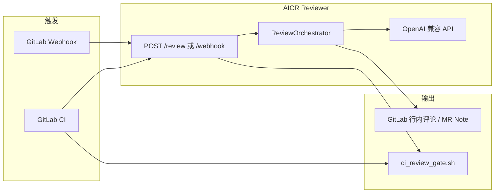

# 大模型代码评审说明

本文档说明本工程（**AICR Reviewer**）如何利用大语言模型（LLM）对 GitLab Merge Request 进行自动代码评审，涵盖端到端流程、提示词设计、模型接入与结果处理。系统架构总览见 [ARCHITECTURE.md](ARCHITECTURE.md)；运行与 API 见 [aicr-reviewer/README.md](../aicr-reviewer/README.md)。

> 浏览器阅读版：[LLM_CODE_REVIEW.html](LLM_CODE_REVIEW.html)（含侧边目录与流程图）

---

## 1. 目标与边界

| 能力 | 说明 |
|------|------|
| **做什么** | 读取 MR 的 diff 与可选全文，结合项目/团队规范，由 LLM 输出结构化评分与问题列表，并写回 GitLab |
| **不做什么** | 不替代单元测试、不执行代码、不保证 100% 正确；LLM 幻觉与漏报需人工复核 |
| **门禁策略** | CI 仅在「评审真实完成」且「分数低于阈值」时拦截 MR；服务异常时 **fail-open**（放行），避免 LLM/GitLab 故障阻塞合并 |

---

## 2. 整体流程



**一次完整评审**在 `ReviewOrchestrator.run()` 中按以下顺序执行：

1. **构建上下文** — 从 GitLab 拉取 MR 元数据、变更文件、unified diff；对支持的语言读取源分支完整文件（辅助理解上下文）。
2. **分块** — 按 token 预算将多个文件拆成多块，每块独立调用 LLM。
3. **渲染提示词** — Jinja2 模板生成 system / user 消息。
4. **脱敏** — 对 diff 与上下文中的疑似密钥做占位替换后再送入模型。
5. **调用 LLM** — OpenAI Chat Completions（`response_format: json_object`，不支持时自动降级）。
6. **解析 JSON** — 规范为 `score`、`summary`、`issues[]`。
7. **聚合** — 多块取**最低分**，合并全部 `issues`。
8. **发布** — 向 MR 发布行内讨论或 Note，并发布总分摘要（`REVIEW_DRY_RUN=1` 时跳过发布）。

核心编排代码：`aicr-reviewer/app/review/orchestrator.py`。

---

## 3. 如何触发评审

### 3.1 GitLab CI（推荐用于 MR 门禁）

在 MR 流水线中执行 `aicr-reviewer/scripts/ci_review_gate.sh`，脚本向评审服务发起：

```http
POST {AICR_REVIEW_URL}/review
Content-Type: application/json
X-AICR-Secret: {AICR_REVIEW_SECRET}   # 若配置了 REVIEW_API_SECRET

{"project_id": <CI_PROJECT_ID>, "mr_iid": <CI_MERGE_REQUEST_IID>}
```

示例片段见 `aicr-reviewer/ci/gitlab-ci.snippet.yml`。

**门禁逻辑**（在 Runner 侧，非 HTTP 状态码）：

- `review_completed != true` → **通过**（含 LLM 失败、无可审文件、网络错误等）
- `review_completed == true` 且 `score < AICR_SCORE_THRESHOLD`（默认 60）→ **失败 job，拦截 MR**
- 否则 → **通过**

### 3.2 GitLab Webhook（异步评论）

配置 `POST /webhook/gitlab`，校验 `X-Gitlab-Token` 与 `GITLAB_WEBHOOK_SECRET`。仅处理 MR 的 `open` / `update` / `reopen` 事件；评审在 `BackgroundTasks` 中异步执行，HTTP 立即返回 `accepted`。

---

## 4. 送入大模型的内容

### 4.1 项目上下文（System 侧）

优先级：

1. 业务仓库中的 **`.llm/CONTEXT.md`**（从 MR 源分支或目标分支读取，超过 `CONTEXT_MAX_CHARS` 会截断）
2. 若不存在，使用内置 **Spring Boot / Spring Cloud 默认约定**（`ContextBuilder._default_context()`）

该内容注入 `system_spring.j2` 的「Project-Specific Context」段落，用于约束团队架构、命名、安全规范等。

### 4.2 MR 与代码变更（User 侧）

`user_review.j2` 包含：

| 字段 | 来源 |
|------|------|
| MR 标题 / 描述 | GitLab MR API |
| 变更文件列表 | MR changes API |
| Unified diff | 每个变更文件的 `diff` |
| 完整文件内容 | 对 `SUPPORTED_EXTENSIONS` 内文件从源分支 `files.raw` 读取（过大时由分块器截断） |

支持扩展名定义在 `ContextBuilder.SUPPORTED_EXTENSIONS`（如 `.java`、`.kt`、`.yml`、`.py` 等）。

### 4.3 脱敏

`app/utils/redact.py` 在送入 LLM 前替换：

- `password` / `secret` / `api_key` / `token` 等键值对
- GitLab PAT 前缀 `glpat-`
- AWS 访问键前缀 `AKIA`

脱敏可降低密钥泄露风险，**不能**替代「不在 MR 中粘贴真实密钥」的规范。

### 4.4 分块与上下文窗口

`DiffChunker` 用 `REVIEW_MAX_INPUT_TOKENS`（默认 12000）估算每块字符上限（约 1 token ≈ 4 字符）。单文件超过预算时截断 diff 并丢弃全文，避免单次请求撑爆上下文。

多块评审时，user 提示末尾会附加：`Note: chunk i/n. Review only the files shown.`

---

## 5. 提示词设计

模板目录：`aicr-reviewer/app/review/prompts/`。

### 5.1 System 提示（`system_spring.j2`）

定义评审者角色与检查维度，例如：

- **正确性与安全**：NPE、吞异常、硬编码密钥
- **Spring / Spring Cloud**：`@Transactional` 自调用、Feign N+1、超时与熔断
- **API 设计**：`@Valid`、统一异常处理
- **性能与配置**：循环内低效操作、明文配置、Actuator 暴露

并规定 **0–100 分档含义** 与 **必须输出的 JSON Schema**（`score`、`summary`、`issues[]`，含 `severity`、`category`、`file`、`line`、`message`、`suggestion`）。

### 5.2 User 提示（`user_review.j2`）

将 MR 信息与 diff 包在代码块中，末尾要求：`Provide your review as a JSON object with score, summary, and issues.`

### 5.3 自定义提示词

修改 `*.j2` 后重启服务即可；若需非 Spring 场景，可新增 system 模板并在 `PromptRenderer.render_system()` 中切换 `language_hint` 或模板名。

---

## 6. 大模型接入

### 6.1 协议与实现

- 统一通过 **OpenAI Chat Completions** 兼容接口（`app/llm/openai_compat.py`）。
- 工厂 `app/llm/factory.py` 按 `LLM_PROVIDER` 选择预设 `api_base`，也可用 `LLM_API_BASE` 覆盖。

| `LLM_PROVIDER` | 预设 API Base |
|----------------|---------------|
| `ctyun_openai` | `https://wishub-x6.ctyun.cn/v1` |
| `deepseek` | `https://api.deepseek.com/v1` |
| `zhipu` | `https://open.bigmodel.cn/api/paas/v4` |
| `openai` | `https://api.openai.com/v1` |

### 6.2 调用参数

| 环境变量 | 默认 | 作用 |
|----------|------|------|
| `LLM_MODEL` | （必填） | 模型名，如 `deepseek-chat` |
| `LLM_API_KEY` | （必填） | API 密钥 |
| `LLM_TEMPERATURE` | `0.2` | 偏低温度，利于稳定 JSON 输出 |
| `LLM_MAX_TOKENS` | `4096` | 单次 completion 上限 |
| `LLM_TIMEOUT_SECONDS` | `120` | HTTP 超时 |

### 6.3 JSON 模式

优先设置 `response_format: {"type": "json_object"}`。若提供商不支持，自动去掉该参数重试一次。

每次请求为 **两轮消息**：

```text
system: <渲染后的 system_spring.j2>
user:   <渲染后的 user_review.j2 + 可选分块说明>
```

---

## 7. 解析与聚合

### 7.1 解析（`StructuredResponseParser`）

- 去除 markdown 代码块包裹（`` ```json ``）。
- `json.loads` 失败时，用正则从文本中提取含 `score` / `issues` 的 JSON 对象。
- 规范化：`score` 限制在 0–100；`issues` 中字段缺省补默认值。

解析失败 → 该分块记为 `LLMReviewError`；**全部分块失败**时 API 返回 `review_completed=false`（fail-open）。

### 7.2 聚合规则

| 字段 | 规则 |
|------|------|
| `score` | 各块 `score` 的 **最小值**（任一块严重问题都会拉低总分） |
| `summary` | 各块 summary 用 ` \| ` 拼接；部分块失败时追加 `Partial LLM failures: ...` |
| `issues` | 各块 issues **合并**（不去重；发布时按 fingerprint 去重评论） |

---

## 8. 结果写回 GitLab

`GitLabPublisher`（`REVIEW_DRY_RUN=0` 时）：

1. **每条 issue** — 优先创建 **行内 discussion**（需有效 `diff_refs` 与行号）；失败则回退为 **MR Note** 并注明位置。
2. **摘要 Note** — 标题 `AICR Review Summary: PASSED/FAILED`，包含分数、阈值、问题数量与 summary 文本。

评论正文格式示例：

```markdown
**AICR 评审** (major/security)

<问题描述>

**建议**: <修复建议>
```

同一 MR 批次内按 `file:line:category` MD5 去重，避免重复发帖。

API 响应中的 `code_quality` 字段为 Code Climate 风格结构，便于与其他工具对接，CI 门禁仍以 `score` 与 `review_completed` 为准。

---

## 9. API 响应语义（与 LLM 的关系）

`POST /review` 响应：

| 字段 | 含义 |
|------|------|
| `score` | 0–100；未实际评审时为占位 **100** |
| `review_completed` | `true` 表示 LLM 流水线已成功跑完；**仅此时 CI 才应按分数拦 MR** |
| `summary` | 评审摘要；跳过时含 `fail-open` 原因 |
| `issues` | 结构化问题列表 |
| `code_quality` | 标准化质量问题描述 |

| 场景 | `review_completed` | CI 门禁 |
|------|-------------------|---------|
| LLM/解析/GitLab/鉴权/超时等异常 | `false` | 放行 |
| 无支持扩展名的可审变更 | `false` | 放行 |
| 评审成功且 `score >= 阈值` | `true` | 放行 |
| 评审成功且 `score < 阈值` | `true` | **拦截** |

设计意图：**宁可漏拦，不可因 AI 服务故障误拦合并**。

---

## 10. 配置与扩展清单

### 10.1 最小可运行配置

见 [SECRETS.md](SECRETS.md)。至少需要：`AICR_BOT_TOKEN`、`GITLAB_URL`、`LLM_API_KEY`、`LLM_MODEL`。

### 10.2 按项目调优

| 目标 | 做法 |
|------|------|
| 贴合团队规范 | 在业务仓库添加 `.llm/CONTEXT.md` |
| 调整检查侧重点 | 编辑 `app/review/prompts/system_spring.j2` |
| 支持更多语言 | 修改 `ContextBuilder.SUPPORTED_EXTENSIONS` |
| 控制成本与延迟 | 降低 `REVIEW_MAX_INPUT_TOKENS`、选用更小/更快模型 |
| 仅调试 LLM、不写评论 | `REVIEW_DRY_RUN=1` |
| 调整通过线 | `AICR_SCORE_THRESHOLD`（服务摘要与 CI 脚本共用） |

### 10.3 本地验证

```bash
# 健康检查（含 llm_provider / llm_model）
curl http://localhost:8001/health

# 冒烟（需配置 evn/.env）
cd aicr-reviewer && python scripts/smoke_test.py
```

Demo 工程：`test_data/spring-cloud-demo/`，推送后可通过 MR 触发 CI 联调。

---

## 11. 关键源码索引

| 模块 | 路径 | 职责 |
|------|------|------|
| 流水线编排 | `app/review/orchestrator.py` | 上下文 → 分块 → LLM → 聚合 → 发布 |
| 提示词渲染 | `app/review/prompt_renderer.py` | Jinja2 加载 `prompts/*.j2` |
| System/User 模板 | `app/review/prompts/*.j2` | 评审规则与 MR 输入格式 |
| Diff 分块 | `app/review/chunker.py` | Token 预算切分 |
| 响应解析 | `app/review/parser.py` | JSON 提取与规范化 |
| LLM 客户端 | `app/llm/openai_compat.py` | Chat Completions + JSON 模式 |
| 提供商工厂 | `app/llm/factory.py` | 多厂商 endpoint 预设 |
| MR 上下文 | `app/gitlab/context_builder.py` | GitLab 数据 + `.llm/CONTEXT.md` |
| 评论发布 | `app/gitlab/publisher.py` | 行内讨论 / Note / 摘要 |
| HTTP 入口 | `app/api/routes.py` | `/review`、`/webhook/gitlab`、fail-open |
| 脱敏 | `app/utils/redact.py` | 送入模型前的密钥替换 |
| CI 门禁 | `scripts/ci_review_gate.sh` | 按 `review_completed` 与分数判定 |

---

## 12. 局限与运维建议

1. **LLM 输出不稳定** — 依赖低温度、JSON 模式与解析兜底；重大变更建议人工再看一眼 MR 评论。
2. **大 MR 分块** — 块与块之间无交叉引用，可能遗漏跨文件问题；可适当提高 `REVIEW_MAX_INPUT_TOKENS` 或拆分 MR。
3. **行号与行内评论** — 模型给出的 `line` 若不在 diff 范围内，会回退为普通 Note。
4. **成本** — 每个分块一次 completion；文件越多、diff 越大，调用次数与 token 消耗越高。
5. **安全** — 生产务必配置 `REVIEW_API_SECRET`、`GITLAB_WEBHOOK_SECRET`；定期轮换 `LLM_API_KEY` 与 Bot Token。

---

## 相关文档

- [ARCHITECTURE.md](ARCHITECTURE.md) — 组件图与失败策略表
- [SECRETS.md](SECRETS.md) — 环境变量与安全实践
- [aicr-reviewer/README.md](../aicr-reviewer/README.md) — 部署、API、CI 片段
