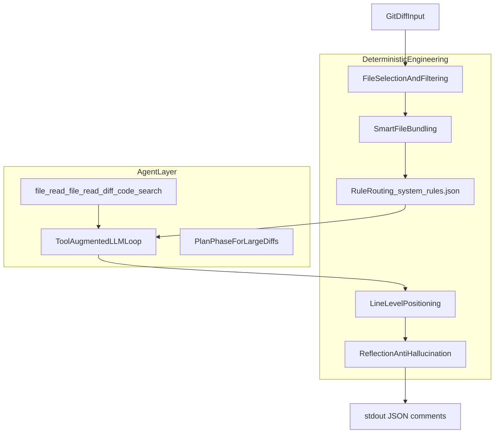
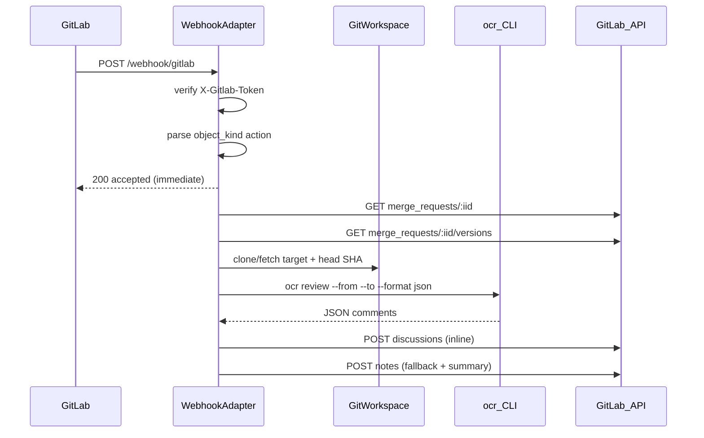
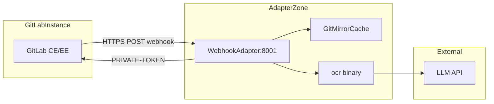
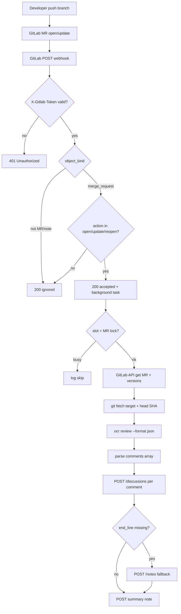
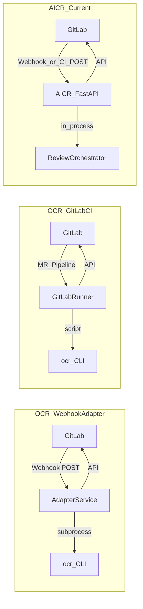
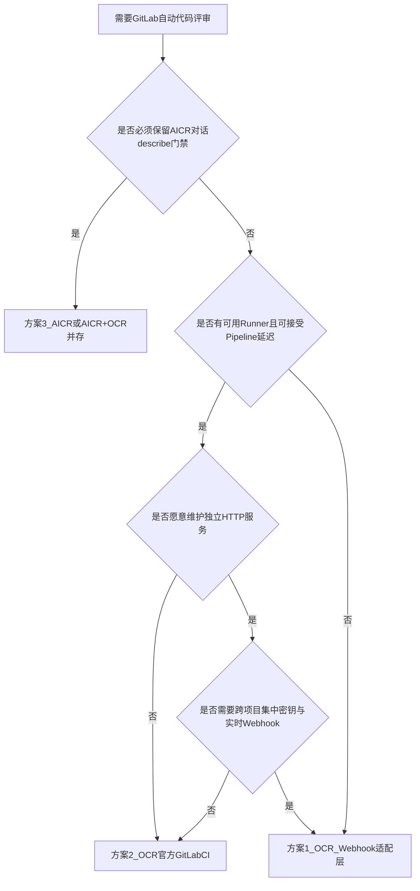

# OCR + GitLab Webhook 集成可行性分析与技术指南

> 本文档评估 [Alibaba Open Code Review (OCR)](https://github.com/alibaba/open-code-review) 与 GitLab 集成的技术可行性，给出落地架构、配置映射与注意事项，并横向对比三种方案：**OCR + Webhook 适配层**、**OCR GitLab CI 官方路径**、**AICR Reviewer（本仓库）**。
>
> **文档依据**：OCR 官方 README / GitLab CI 示例；AICR 源码 [`aicr-reviewer/app/api/routes.py`](../aicr-reviewer/app/api/routes.py)、[`evn/.env.example`](../evn/.env.example)；架构与 CI 门禁见 [`系统架构.md`](./系统架构.md)、[`CI评审流水线.md`](./CI评审流水线.md)。

---

## 目录

1. [可行性分析](#1-可行性分析)
2. [集成方案](#2-集成方案)
3. [部署架构](#3-部署架构)
4. [触发流程](#4-触发流程)
5. [配置指南](#5-配置指南)
6. [三方案横向对比](#6-三方案横向对比)
   - [6.1 方案概览](#61-方案概览)
   - [6.2 多维度对照表](#62-多维度对照表)
   - [6.3 各方案优势](#63-各方案优势)
   - [6.4 各方案劣势](#64-各方案劣势)
   - [6.5 场景选型决策树](#65-场景选型决策树)
   - [6.6 推荐组合策略](#66-推荐组合策略)
7. [注意事项](#7-注意事项)
- [附录 A：Webhook Payload 样例](#附录-a-webhook-payload-样例)
- [附录 B：OCR JSON 输出结构](#附录-b-ocr-json-输出结构)
- [附录 C：参考链接](#附录-c-参考链接)

---

## 1. 可行性分析

### 1.1 结论

**技术上可行，但必须引入适配层。** GitLab Webhook 与 OCR 在「事件数据格式」上兼容，在「运行形态」上不兼容：

| 维度 | OCR | GitLab Webhook | 兼容性 |
|------|-----|----------------|--------|
| 触发方式 | CLI 子进程 / CI Job | HTTP POST JSON | 需中间层转换 |
| MR 事件 | 无原生监听 | `object_kind=merge_request` | 适配层解析后调用 `ocr review` |
| Note 事件 | 无原生监听 | `object_kind=note` | 可用触发词模式（如 `@open-code-review`） |
| 结果回写 | 需调用 GitLab REST API | 仅推送事件，不接收评审结果 | OCR 官方 CI 脚本已提供 posting 参考实现 |
| 架构风格 | 确定性工程 + Agent 混合 | 事件驱动、异步 HTTP | 职责解耦，集成清晰 |

OCR **不提供** 内置 HTTP 服务或 Webhook 端点；其官方 GitLab 集成路径是 **Merge Request Pipeline + `ocr review` CLI**（见 [examples/gitlab_ci/.gitlab-ci.yml](https://github.com/alibaba/open-code-review/blob/main/examples/gitlab_ci/.gitlab-ci.yml)）。若要以 Webhook 实时触发，需自建 **Webhook 适配层**（或 Webhook → 触发 CI Pipeline 的间接方案）。

### 1.2 OCR 架构特点

OCR 基于 **Go 1.25+ 单二进制 CLI**（命令名 `ocr`，发行包 `opencodereview`），采用 **确定性工程 × Agent** 混合架构：



**确定性工程层**（Go 代码保证）：

- 变更文件筛选：二进制/扩展名过滤、include/exclude、内置测试文件排除
- Smart bundling：相关文件合并为子任务
- 规则路由：`system_rules.json` + 项目/全局 `.opencodereview/rule.json` 四层优先级
- 行级定位：三层渐进 LLM 策略，将评论锚定到 diff 行
- Reflection：拦截幻觉与偏离 diff 的评论

**Agent 层**（LLM + 工具循环）：

- 内置工具：`file_read`、`file_read_diff`、`file_find`、`code_search`（git grep）、`code_comment`、`task_done`
- 大 diff（>50 行）先 Plan 再逐文件/逐 bundle 评审
- 默认并发 8 路文件评审，单任务超时默认 10 分钟

**输出形态**：

```bash
ocr review --from origin/main --to HEAD --format json --audience agent
```

stdout 为 JSON：`{ status, message, summary, comments[], warnings[] }`（详见 [附录 B](#附录-b-ocr-json-输出结构)）。

### 1.3 GitLab Webhook 事件机制

GitLab 在配置的事件发生时，向指定 URL 发送 **HTTP POST**，Body 为 JSON，请求头携带：

| Header | 说明 |
|--------|------|
| `X-Gitlab-Event` | 事件类型，如 `Merge Request Hook`、`Note Hook` |
| `X-Gitlab-Token` | 与 Webhook 配置中 Secret Token 一致（若已设置） |
| `Content-Type` | `application/json` |

GitLab 期望服务端 **快速返回 2xx**；长时间评审必须在后台异步执行，否则可能触发 Webhook 重试或超时（通常约 10 秒量级）。

本仓库 AICR 已实现的标准处理模式（可作为 OCR 适配层参考）：

```372:384:aicr-reviewer/app/api/routes.py
def _verify_gitlab_webhook(request: Request) -> None:
    if not GITLAB_WEBHOOK_SECRET:
        if not GITLAB_WEBHOOK_ALLOW_INSECURE:
            raise HTTPException(
                status_code=503,
                detail="GITLAB_WEBHOOK_SECRET not configured",
            )
        logger.warning("Webhook running without secret (GITLAB_WEBHOOK_ALLOW_INSECURE=1)")
    else:
        token = request.headers.get("X-Gitlab-Token", "")
        if not token or not secrets.compare_digest(token, GITLAB_WEBHOOK_SECRET):
            logger.warning("Webhook token mismatch")
            raise HTTPException(status_code=401, detail="Unauthorized")
```

### 1.4 兼容性评估

| 集成点 | 评估 | 说明 |
|--------|------|------|
| MR open/update/reopen | ✅ 可行 | payload 含 `project.id`、`object_attributes.iid`、commit SHA，足够驱动 `ocr review` |
| Fork MR | ✅ 可行 | 须用 `last_commit.id` / head SHA 作 `--to`，不能用源分支 ref（OCR CI 示例已验证） |
| Inline 评论回写 | ✅ 可行 | 需 MR `versions` API 获取 `base_sha/start_sha/head_sha`；OCR 官方 Python 脚本已实现 |
| Note 人工触发 | ⚠️ 需自建 | OCR 无 ask 模块；可仿 AICR `@aicr` 模式解析 Note 后 exec OCR |
| CI 分数门禁 | ⚠️ 需扩展 | OCR JSON 无 AICR 式 `score/review_completed`；门禁需自定义规则或另建评分逻辑 |
| 增量/状态持久化 | ⚠️ 差异 | OCR 无内置 MR 级 review state；重复 `update` webhook 可能重复评审 |

**总体判定**：Webhook 集成 **工程上成熟可行**，工作量集中在 **适配层**（HTTP 服务 + git 仓库准备 + GitLab API posting），而非 OCR 本身改造。

---

## 2. 集成方案

OCR 与 GitLab 的集成有两条主路径：**方案 A（Webhook 适配层）** 与 **方案 B（GitLab CI Pipeline）**。二者可并存：Webhook 触发集中式评审服务，或 Webhook 仅触发 Pipeline。

### 2.1 方案 A：Webhook 适配层（与 AICR 模式最接近）

#### 架构概览



适配层职责：

1. **入站**：接收 GitLab Webhook，校验 Secret，解析事件
2. **调度**：异步任务队列 / BackgroundTasks，MR 级互斥锁，全局并发上限
3. **准备仓库**：clone mirror 或 workspace，`git fetch` MR head commit
4. **执行 OCR**：`subprocess` 调用 `ocr review`
5. **回写**：将 JSON `comments[]` 转为 GitLab discussions/notes（可移植 OCR 官方 Python 脚本）

#### merge_request 事件处理

对照 AICR 实现：

```537:550:aicr-reviewer/app/api/routes.py
    if object_kind != "merge_request":
        return {"status": "ignored", "reason": f"not merge_request: {object_kind}"}

    action = body.get("object_attributes", {}).get("action", "")
    if action not in ("open", "update", "reopen"):
        return {"status": "ignored", "reason": f"action: {action}"}

    project_id = body.get("project", {}).get("id")
    mr_iid = body.get("object_attributes", {}).get("iid")
    if not project_id or not mr_iid:
        return {"status": "ignored", "reason": "missing project_id or mr_iid"}

    _schedule_mr_review(background_tasks, project_id, mr_iid)
    return {"status": "accepted", "project_id": project_id, "mr_iid": mr_iid}
```

**适配层建议规则**：

| 字段 | 用途 |
|------|------|
| `object_attributes.action` | 仅处理 `open` / `update` / `reopen` |
| `project.id` | GitLab API `project_id` |
| `object_attributes.iid` | MR internal id |
| `object_attributes.last_commit.id` | `--to` 目标 SHA（fork MR 必选） |
| `object_attributes.target_branch` | 解析 `--from` 对应 ref |
| `object_attributes.source_branch` | 日志 / 可选 ref |

**update 风暴抑制**（建议移植 AICR 思路）：

- 全局并发：`REVIEW_MAX_CONCURRENT`（AICR 默认 2）
- 同 MR 互斥：`acquire_mr_review(project_id, mr_iid)`（见 `concurrency.py`）
- describe 后抑制：`AICR_SUPPRESS_REVIEW_AFTER_DESCRIBE` + 时间窗口（OCR 适配层可复用同名 env 或自实现 debounce）

#### note 事件处理（可选）

AICR Phase C 已实现 MR 评论对话（`@aicr` / `/ask`）。OCR 无对等能力，但可仿照 **GitHub Actions 的 comment 触发**模式：

- 启用 GitLab Webhook **Comments** 事件
- 过滤条件（对齐 AICR）：
  - `object_attributes.action == "create"`
  - `object_attributes.noteable_type == "MergeRequest"`
  - 非 system note、非 bot 自身评论
  - 正文含触发词，如 `@open-code-review`、`/ocr-review`
- 命中后调度与 MR 事件相同的 OCR 流水线（或 narrower scope）

AICR Note 分支参考：

```473:535:aicr-reviewer/app/api/routes.py
    if object_kind == "note":
        if not AICR_WEBHOOK_NOTE_ENABLED or not AICR_ASK_ENABLED:
            return {"status": "ignored", "reason": "note webhook disabled"}
        ...
        if not should_respond_to_note(...):
            return {"status": "ignored", "reason": "no trigger or bot note"}
        _schedule_note_ask(...)
        return {"status": "accepted", "kind": "note", ...}
```

OCR 适配层若仅需「手动触发全量 re-review」，Note 分支可简化为：匹配触发词 → `_schedule_mr_review`。

#### Webhook 配置要求

在 GitLab **Project → Settings → Webhooks**（或 Group / System 级）：

| 配置项 | 值 |
|--------|-----|
| URL | `https://<adapter-host>/webhook/gitlab` |
| Secret token | 与适配层 `GITLAB_WEBHOOK_SECRET` 一致 |
| Trigger | ✅ Merge request events；可选 ✅ Comments |
| SSL verification | 生产环境启用 |
| Push / Tag / Pipeline 等 | 不需要（适配层应 ignore） |

#### 认证机制

**入站（GitLab → 适配层）**：

- Header `X-Gitlab-Token` 与 `GITLAB_WEBHOOK_SECRET` 做 `secrets.compare_digest` 常量时间比较
- 未配置 Secret 时：生产应返回 **503**；仅本地开发可设 `GITLAB_WEBHOOK_ALLOW_INSECURE=1`

**出站（适配层 → GitLab API）**：

| Token 类型 | Header | 适用场景 |
|------------|--------|----------|
| Personal / Project Access Token | `PRIVATE-TOKEN` | Webhook 适配层（推荐 `api` + `read_repository` scope） |
| CI Job Token | `JOB-TOKEN` | 方案 B CI Job 内 posting |

**出站（适配层 → LLM）**：

- OCR 配置 `OCR_LLM_URL` / `OCR_LLM_TOKEN` / `OCR_LLM_MODEL`，或 `ocr config set llm.*`

#### 事件负载解析字段表

**Merge Request Hook**

| JSON 路径 | 类型 | 说明 |
|-----------|------|------|
| `object_kind` | string | 固定 `"merge_request"` |
| `event_type` | string | 如 `merge_request` |
| `user.username` | string | 触发者 |
| `project.id` | int | 项目 ID |
| `project.path_with_namespace` | string | 如 `group/project` |
| `object_attributes.iid` | int | MR IID |
| `object_attributes.action` | string | open / update / reopen / close / merge / … |
| `object_attributes.state` | string | opened / merged / closed |
| `object_attributes.source_branch` | string | 源分支 |
| `object_attributes.target_branch` | string | 目标分支 |
| `object_attributes.last_commit.id` | string | HEAD commit SHA |
| `object_attributes.url` | string | MR 页面 URL |

**Note Hook**

| JSON 路径 | 类型 | 说明 |
|-----------|------|------|
| `object_kind` | string | 固定 `"note"` |
| `object_attributes.note` | string | 评论正文 |
| `object_attributes.noteable_type` | string | 需为 `MergeRequest` |
| `object_attributes.action` | string | 通常仅处理 `create` |
| `object_attributes.system` | bool | system note 应忽略 |
| `object_attributes.discussion_id` | string | 讨论线程 ID（可选） |
| `merge_request.iid` | int | 关联 MR |
| `project.id` | int | 项目 ID |
| `user.username` | string | 评论作者 |

完整样例见 [附录 A](#附录-a-webhook-payload-样例)。

---

### 2.2 方案 B：GitLab CI 触发（OCR 官方路径）

> **本地逐步操作**：见 [ocr-ci/docs/本地部署指南.md](../ocr-ci/docs/本地部署指南.md)（构建 `ocr-ci/Dockerfile` + slim snippet；bootstrap 为零镜像备选）。Snippet：[`ocr-ci/gitlab-ci.ocr.snippet.yml`](../ocr-ci/gitlab-ci.ocr.snippet.yml)、[`post_ocr_to_gitlab.py`](../ocr-ci/scripts/post_ocr_to_gitlab.py)。

OCR 官方未提供 Webhook Server；**推荐的生产范例是 MR Pipeline**。

```yaml
# 摘自 OCR 官方 examples/gitlab_ci/.gitlab-ci.yml
code-review:
  stage: review
  only:
    - merge_requests
  variables:
    GIT_DEPTH: 0
  script:
    - npm install -g @alibaba-group/open-code-review
    - ocr config set llm.url $OCR_LLM_URL
    - ocr review --from "origin/${CI_MERGE_REQUEST_TARGET_BRANCH_NAME}" \
                 --to "${CI_COMMIT_SHA}" \
                 --format json --audience agent > /tmp/ocr-result.json
    - python3 post_comments_to_gitlab.py  # 官方内联脚本
```

**特点**：

- 无需额外 HTTP 服务；Runner 内已有完整 git checkout
- `resource_group: mr-review-$CI_MERGE_REQUEST_IID` 天然 MR 级串行
- Fork MR：`--to ${CI_COMMIT_SHA}` 正确解析 fork 源 commit
- posting、rate-limit 重试已在官方 Python 脚本中实现

**与 Webhook 的关系**：

- **非直连**：GitLab 不向 OCR 发 Webhook；而是 MR 事件创建 Pipeline
- **间接 Webhook**：若组织要求「Webhook 统一入口」，可由 Webhook 适配层调用 GitLab **Pipeline Trigger API** 或 **Trigger Token**，间接启动 CI Job——本质仍是方案 B，只是触发源改为 HTTP

#### 方案选型

三种方案的完整对比、优劣势与决策树见 [§6 三方案横向对比](#6-三方案横向对比)。此处仅列快速参考：

| 场景 | 推荐 |
|------|------|
| 跨项目集中评审、统一 LLM 密钥与规则 | 方案 1（Webhook 适配层） |
| 零额外服务、评审与 CI 强绑定 | 方案 2（OCR GitLab CI） |
| MR 评论问答、describe、分数门禁、增量评审 | 方案 3（AICR） |
| 快速试点 OCR 引擎 | 方案 2（官方示例可复制） |
| 内网 GitLab 无法跑 CI 或 Runner 资源紧张 | 方案 1（独立评审节点） |

---

## 3. 部署架构

### 3.1 OCR 部署形态

| 方式 | 说明 | 适用 |
|------|------|------|
| NPM 全局安装 | `npm i -g @alibaba-group/open-code-review` → `ocr` | CI 容器、适配层镜像 |
| Release 二进制 | [GitHub Releases](https://github.com/alibaba/open-code-review/releases) `opencodereview-linux-amd64` 等 | 裸机、最小镜像 |
| 源码编译 | Go 1.25+，`make build` | 定制构建 |
| 官方 Docker 镜像 | **无** | 需自建 Dockerfile |
| `ocr viewer` | 本地 :5483 WebUI，查看 session JSONL | 调试 only，非评审服务 |

**自建适配层镜像示例结构**：

```
ocr-webhook-adapter/
├── Dockerfile          # node:20-slim 或 debian + ocr binary + git + python3
├── adapter/            # FastAPI/Go HTTP 服务
├── scripts/
│   └── post_gitlab.py  # 自 OCR 官方示例移植
└── entrypoint.sh
```

### 3.2 Webhook 适配层部署（方案 A）



**网络连接**：

| 方向 | 协议 | 说明 |
|------|------|------|
| GitLab → Adapter | HTTPS 443 | Webhook 入站；需 GitLab 能解析 adapter 域名 |
| Adapter → GitLab API | HTTP(S) | 同实例内网或公网；`GITLAB_URL` |
| Adapter → LLM | HTTPS | 出网访问模型 API |

**Git 仓库获取**：

| 策略 | 优点 | 风险 |
|------|------|------|
| `git clone --mirror` + fetch ref | 完整 history，OCR merge-base 正确 | 磁盘与首次 clone 耗时 |
| 浅 clone + unshallow | 节省空间 | 大仓库 unshallow 仍慢 |
| GitLab archive 下载 | 简单 | **无完整 git 历史时 OCR diff 可能失败** |

Token 需 **`read_repository`**（clone/fetch）+ **`api`**（MR discussions）。

**与 GitLab 实例通信要点**：

- 自建 GitLab：`GITLAB_URL=http://gitlab.internal:8929`
- Docker Compose 同网：`http://gitlab:8000`（参考本仓库 `evn/gitlab`）
- Fork MR：始终用 commit SHA 作 diff 右端点
- API Rate Limit：移植 OCR 官方 `OCR_RETRY_*`、`OCR_RATE_LIMIT_THRESHOLD` 环境变量

### 3.3 方案 B CI 部署

- 在业务仓库或 CI 模板仓库添加 `.gitlab-ci.yml` job
- CI/CD Variables：`OCR_LLM_URL`、`OCR_LLM_AUTH_TOKEN`（Masked）、可选 `GITLAB_API_TOKEN`
- Runner 标签：需支持 `docker` executor 或安装 node/git/python 的 shell executor
- `GIT_DEPTH: 0`：**必须**，否则 merge-base 计算错误

### 3.4 高可用与伸缩

|  Concern | 方案 A | 方案 B |
|----------|--------|--------|
| 水平扩展 | 多 adapter 实例 + 共享队列（Redis/RabbitMQ） | 多 Runner |
| MR 互斥 | 应用层 per-MR lock | CI `resource_group` |
| 状态 | 无状态 adapter + 可选 git mirror volume | 无状态 job |
| 健康检查 | adapter 提供 `GET /health` | CI job 成功/失败 |

OCR 本身无健康端点；`ocr version` 可用于镜像启动探测。

---

## 4. 触发流程

### 4.1 端到端流程（方案 A：MR Webhook）



### 4.2 分步说明

1. **开发者动作**：推送分支或更新 MR 描述/代码 → GitLab 生成 `merge_request` 事件（action 多为 `update`）。
2. **Webhook 投递**：GitLab 向 `{ADAPTER_URL}/webhook/gitlab` POST JSON，携带 `X-Gitlab-Token`。
3. **同步阶段（<1s）**：
   - 校验 Token（`secrets.compare_digest`）
   - 解析 `object_kind`、`action`、IDs
   - 不符合规则 → `200 {"status":"ignored"}`
   - 符合规则 → 投递后台任务 → `200 {"status":"accepted"}`
4. **异步阶段 — 并发控制**（参考 AICR `concurrency.py`）：
   - 获取全局 semaphore（`REVIEW_MAX_CONCURRENT`）
   - 获取 `(project_id, mr_iid)` 互斥锁
   - 失败则 log 并退出（不阻塞 HTTP）
5. **准备 diff 上下文**：
   - `GET /projects/:id/merge_requests/:iid`
   - `GET /projects/:id/merge_requests/:iid/versions` → `base_sha`, `start_sha`, `head_sha`
   - 本地 git：`git fetch origin refs/merge-requests/:iid/head` 或使用 API 提供的 SHA
6. **执行 OCR**：
   ```bash
   ocr review \
     --repo /workspace/project \
     --from "origin/${TARGET_BRANCH}" \
     --to "${HEAD_SHA}" \
     --format json \
     --audience agent \
     --concurrency 8 \
     --timeout 10
   ```
7. **解析输出**：读取 stdout JSON；stderr 保留供故障 note。
8. **回写 GitLab**：
   - 对每条 `comments[]`：`POST .../discussions`，`position.position_type=text`，填 `new_path/new_line/base_sha/start_sha/head_sha`
   - `end_line == 0` 或缺 position → 汇总到 fallback MR note
   - 最后发 summary note（评论数、warnings）
9. **释放锁与槽位**。

### 4.3 Note 触发流程（可选）

1. 用户在 MR 评论：`@open-code-review 请重点看 auth 模块`
2. GitLab 发送 `object_kind=note` Webhook
3. 适配层校验触发词、排除 bot 循环
4. 后续与 MR 流程步骤 4–9 相同（可将 `--background` 传入用户问题摘要）

### 4.4 三方案流程差异

> **说明**：方案 1（Webhook 适配层）与方案 2（GitLab CI）在 `ocr review` 执行与 posting 阶段相同，差异仅在**触发源**（Webhook HTTP vs Pipeline Job）与 **git 上下文获取方式**（自建 mirror vs Runner checkout）。方案 3（AICR）使用 in-process 编排，不调用 OCR CLI。

| 步骤 | 方案 1：OCR + 适配层 | 方案 2：OCR GitLab CI | 方案 3：AICR |
|------|---------------------|----------------------|--------------|
| 触发 | Webhook → 自建 HTTP | MR Pipeline Job | `POST /webhook/gitlab` 或 `POST /review` |
| HTTP 入口 | 需新建或 fork AICR 路由 | 无（Runner 内 script） | `POST /webhook/gitlab` 已实现 |
| Git 上下文 | 自建 clone/mirror + fetch | Runner checkout（`GIT_DEPTH: 0`） | GitLab API via `GitLabMRSession` |
| 评审执行 | `subprocess: ocr review` | 同左 | `ReviewOrchestrator.run()` in-process |
| Diff 来源 | 本地 git + OCR diff 引擎 | 同左 | GitLab API diff + 可选增量 compare |
| 结果发布 | OCR 官方 Python posting 脚本 | 同左 | `GitLabPublisher` |
| 评分/CI | JSON 无内置 score；需自定义 | 同左 | `score` + `review_completed` + `ci_review_gate.sh` |
| 增量评审 | 每次 CLI 全量 range | 每次 Pipeline 全量 range | `ReviewStateStore` SHA 增量 |

---

## 5. 配置指南

### 5.1 三方参数映射总表

| 用途 | GitLab Webhook 配置 | OCR 配置 | 适配层环境变量（建议） |
|------|---------------------|----------|------------------------|
| 入站认证 | Secret token | — | `GITLAB_WEBHOOK_SECRET` |
| 入站开发放行 | — | — | `GITLAB_WEBHOOK_ALLOW_INSECURE=0` |
| GitLab 实例 URL | — | — | `GITLAB_URL` |
| GitLab API 认证 | — | `GITLAB_API_TOKEN`（CI） | `GITLAB_API_TOKEN` 或 `AICR_BOT_TOKEN` |
| LLM 端点 | — | `OCR_LLM_URL` / `ocr config set llm.url` | 同 OCR |
| LLM 密钥 | — | `OCR_LLM_TOKEN` / `llm.auth_token` | Masked secret |
| LLM 模型 | — | `OCR_LLM_MODEL` / `llm.model` | 如 `gpt-4o`、`claude-opus-4-6` |
| Anthropic 协议 | — | `OCR_USE_ANTHROPIC` / `llm.use_anthropic` | `true` / `false` |
| Diff 左端点 | — | `--from origin/target_branch` | 从 MR `target_branch` 解析 |
| Diff 右端点 | payload `last_commit.id` | `--to <sha>` | **必须用 SHA**（fork MR） |
| 输出格式 | — | `--format json` | 固定 json |
| 并发度 | — | `--concurrency 8` | 适配层 `OCR_REVIEW_CONCURRENCY` |
| 单文件超时 | — | `--timeout 10`（分钟） | — |
| 评审语言 | — | `ocr config set language Chinese` | — |
| 自定义规则 | — | `.opencodereview/rule.json` | 仓库内或挂载卷 |
| 全局并发上限 | — | — | `REVIEW_MAX_CONCURRENT=2`（AICR 默认） |
| Note 触发词 | Comments 事件 | — | `OCR_NOTE_TRIGGERS=@open-code-review,/ocr-review` |
| Note 功能开关 | — | — | `OCR_WEBHOOK_NOTE_ENABLED=1` |
| Git 历史深度 | — | 需完整 history | 适配层 clone 策略 / `GIT_DEPTH=0`（CI） |
| API 重试 | — | `OCR_RETRY_*`, `OCR_RATE_LIMIT_THRESHOLD` | posting 脚本 env |
| Bot 用户名 | — | — | `OCR_BOT_USERNAME=ocr-bot`（防循环） |

### 5.2 OCR 配置

**配置文件路径**：

| 文件 | 用途 |
|------|------|
| `~/.opencodereview/config.json` | 全局 LLM、language、telemetry |
| `<repo>/.opencodereview/rule.json` | 项目评审规则 |
| `~/.opencodereview/rule.json` | 用户级规则 |

**CLI 初始化示例**：

```bash
ocr config set llm.url "https://api.openai.com/v1/chat/completions"
ocr config set llm.auth_token "$OCR_LLM_TOKEN"
ocr config set llm.model "gpt-4o"
ocr config set llm.use_anthropic false
ocr config set llm.extra_body '{"thinking": {"type": "disabled"}}'
ocr config set language Chinese
```

**环境变量覆盖**（优先级高于 config 文件）：

```bash
export OCR_LLM_URL="https://api.openai.com/v1/chat/completions"
export OCR_LLM_TOKEN="sk-..."
export OCR_LLM_MODEL="gpt-4o"
export OCR_USE_ANTHROPIC=false
```

**Review 常用 CLI 参数**：

| 参数 | 默认值 | 说明 |
|------|--------|------|
| `--repo` | cwd | Git 仓库根目录 |
| `--from` / `--to` | — | 分支或 commit range |
| `--commit` | — | 单 commit 评审 |
| `--format` | `text` | 集成时用 `json` |
| `--audience` | `human` | CI/适配层用 `agent`（减少 progress 噪声） |
| `--concurrency` | `8` | 并行文件数 |
| `--timeout` | `10` | 分钟 |
| `--rule` | — | 指定规则 JSON |
| `--background` | — | 业务背景（Note 触发时可传入用户问题） |
| `--preview` | false | 仅列出待审文件 |

### 5.3 GitLab Webhook 配置

**Project Webhook UI 步骤**：

1. 进入 **Settings → Webhooks**
2. **URL**：`https://aicr.example.com/webhook/gitlab`（方案 A）或自建 adapter 地址
3. **Secret token**：生成随机串，写入适配层 `GITLAB_WEBHOOK_SECRET`
4. **Trigger**：
   - ✅ Merge request events
   - ✅ Comments（若需 Note 触发）
5. **Enable SSL verification**：生产勾选
6. 保存后使用 **Test → Merge requests events** 发送探测（注意测试 payload 可能缺少真实 `iid`）

**Group / System 级 Webhook**：同样字段；适合组织级统一 OCR 适配层。

**与 AICR 共存**：同一 URL 只能指向一个服务。若并行试运行，需不同 path 或不同端口，且 GitLab 仅支持有限 webhook 数量。

### 5.4 AICR 现有 Webhook 配置（对照）

来自 [`evn/.env.example`](../evn/.env.example)：

```bash
# Webhook 入站
GITLAB_WEBHOOK_SECRET=
GITLAB_WEBHOOK_ALLOW_INSECURE=0

# 并发（/review + webhook 共享）
REVIEW_MAX_CONCURRENT=2

# Note 对话
AICR_WEBHOOK_NOTE_ENABLED=1
AICR_ASK_ENABLED=1
AICR_ASK_TRIGGERS=@aicr,/ask
AICR_BOT_USERNAME=aicr-bot

# describe 后抑制重复 review
AICR_SUPPRESS_REVIEW_AFTER_DESCRIBE=1
AICR_DESCRIBE_WEBHOOK_SUPPRESS_SECONDS=120
```

迁移到 OCR 时，入站 Webhook 配置可 **原样复用**；LLM 相关变量需切换为 OCR 命名空间。

### 5.5 GitLab CI 变量（方案 B）

| 变量 | 必填 | 说明 |
|------|------|------|
| `OCR_LLM_URL` | ✅ | LLM HTTP 端点 |
| `OCR_LLM_AUTH_TOKEN` | ✅ | Masked |
| `OCR_LLM_MODEL` | 可选 | 默认 gpt-4o |
| `GITLAB_API_TOKEN` | 可选 | 无则用 `CI_JOB_TOKEN` |
| `OCR_RETRY_BASE_DELAY` | 可选 | 默认 2000 ms |
| `OCR_MAX_RETRIES` | 可选 | 默认 3 |
| `OCR_RATE_LIMIT_THRESHOLD` | 可选 | 默认 10 |

---

## 6. 三方案横向对比

本章对三种 GitLab 自动代码评审路径做一站式对比，便于选型与组合部署。

| 编号 | 方案 | 简述 |
|------|------|------|
| **方案 1** | OCR + Webhook 适配层 | GitLab Webhook → 自建 HTTP 服务 → `subprocess: ocr review` → GitLab API 回写 |
| **方案 2** | OCR GitLab CI（官方路径） | MR Pipeline Job 内运行 `ocr review` + 官方 posting 脚本 |
| **方案 3** | AICR（本仓库） | FastAPI 服务，`ReviewOrchestrator` in-process；Webhook + CI 双通道 |

### 6.1 方案概览



### 6.2 多维度对照表

| 维度 | 方案 1：OCR + Webhook 适配层 | 方案 2：OCR GitLab CI（官方） | 方案 3：AICR（本仓库） |
|------|------------------------------|------------------------------|------------------------|
| **触发源** | GitLab Webhook → 自建 HTTP | MR Pipeline Job（[官方示例](https://github.com/alibaba/open-code-review/blob/main/examples/gitlab_ci/.gitlab-ci.yml)） | `POST /webhook/gitlab` + `POST /review`（[`routes.py`](../aicr-reviewer/app/api/routes.py)） |
| **额外服务** | 需 Adapter + git 工作区 | 无（仅 Runner） | 单 FastAPI（`:8001`） |
| **Git 上下文** | 自建 clone/mirror + fetch | Runner 已 checkout（`GIT_DEPTH: 0`） | GitLab API diff + 可选增量 compare（[`context_builder.py`](../aicr-reviewer/app/gitlab/context_builder.py)） |
| **评审引擎** | `subprocess: ocr review` | 同左 | `ReviewOrchestrator` + Jinja prompt |
| **MR 自动评审** | 适配层实现 | CI job `only: merge_requests` | Webhook MR open/update/reopen |
| **评论对话 @bot** | 需自建触发词 | 不支持 | `@aicr` / `/ask`（Phase C） |
| **describe / changelog** | 无 | 无 | `/describe`、`/changelog` |
| **CI 分数门禁** | 需自定义 JSON 规则 | 需自定义（OCR 无 score） | `ci_review_gate.sh` + `review_completed` + `AICR_SCORE_THRESHOLD`（[`系统架构.md`](./系统架构.md)） |
| **增量评审** | 每次 CLI range；无内置 state | 每次 Pipeline 全量 range | `ReviewStateStore` + `AICR_INCREMENTAL_REVIEW` |
| **并发 / 互斥** | 应用层 semaphore + MR lock | `resource_group: mr-review-$CI_MERGE_REQUEST_IID` | [`concurrency.py`](../aicr-reviewer/app/api/concurrency.py) |
| **反馈延迟** | Webhook 后秒级启动（异步） | 受 Pipeline 排队 + Runner 影响 | Webhook 秒级；CI 同步等 `/review` 返回 |
| **LLM 密钥管理** | 集中式 Adapter env | 每仓库 CI/CD Variables | 集中式 `evn/.env` |
| **行内评论** | 移植官方 Python posting | 官方内联脚本 | `GitLabPublisher` |
| **评分体系** | 无统一 score | 无统一 score | 0–100 分 + critical/major 标签 |
| **Self-reflection** | OCR 内置 Reflection 模块 | 同左 | `AICR_SELF_REFLECTION` |
| **Prompt / 规则定制** | `.opencodereview/rule.json` | 同左 | `prompts/variants/*.j2` + TOML |
| **可观测性** | 依赖自建（OCR 可选 OTLP） | CI job 日志 | 结构化 log；OTel 可选懒加载 |
| **资源模型** | 每 review 新子进程，内存峰值高 | 同左（Runner 内） | 长驻进程 + 线程池 |
| **运维复杂度** | 高（Adapter + git + OCR 进程） | 中（依赖 Runner 容量） | 中（单服务） |
| **官方 / 社区支持** | OCR 引擎有；适配层自研 | OCR 官方示例完整 | 项目内深度定制 |

### 6.3 各方案优势

#### 方案 1：OCR + Webhook 适配层

1. **实时事件驱动**：Webhook 触发后秒级启动评审，不依赖 Pipeline 排队。
2. **跨项目集中部署**：OCR 二进制、LLM 密钥、规则可在 Adapter 层统一管理。
3. **可复用 AICR 模式**：token 校验、`BackgroundTasks`、MR 互斥锁等已有实现可参考，降低开发量。
4. **OCR 确定性工程 + Agent 工具链**：`code_search`、`file_read_diff` 等适合大仓库上下文分析。
5. **与 AICR 解耦**：可仅替换评审引擎，保留 AICR 其它 API（describe/ask）——需双服务或路由拆分。

#### 方案 2：OCR GitLab CI（官方路径）

1. **零额外 HTTP 服务**：复制官方 `.gitlab-ci.yml` 即可 POC，无需自建 Adapter。
2. **Runner 内已有完整 git checkout**：无需 Adapter 维护 mirror，`GIT_DEPTH: 0` 保证 merge-base 正确。
3. **`resource_group` 天然 MR 级串行**：Fork MR 用 `CI_COMMIT_SHA` 已在官方示例中验证。
4. **posting + rate-limit 重试已内置**：官方 Python 脚本可直接使用。
5. **评审与 CI 生命周期绑定**：便于「仅 MR Pipeline 通过才 merge」类流程。

#### 方案 3：AICR（当前工程）

1. **开箱即用**：Webhook + CI 双通道已实现，经 [`smoke_test.py`](../aicr-reviewer/scripts/smoke_test.py) 覆盖。
2. **完整产品能力**：评分门禁、增量评审、self-reflection、describe/changelog/ask 一体化。
3. **单服务部署**：in-process 编排，无 OCR 子进程开销与 git mirror 维护。
4. **fail-open 策略成熟**：与 GitLab CI 集成见 [`CI评审流水线.md`](./CI评审流水线.md)。
5. **深度可定制**：项目级 `config.toml`、prompt variants、`.llm/CONTEXT.md` 可按团队规范调整。

### 6.4 各方案劣势

#### 方案 1：OCR + Webhook 适配层

1. **无原生 Webhook/HTTP**：OCR 为纯 CLI，必须维护 Adapter 与 git mirror 基础设施。
2. **子进程模型**：内存峰值高，全局优先级队列难做；MR update 风暴需额外 debounce。
3. **无 score / fail-open 门禁**：与现有 [`ci_review_gate.sh`](../aicr-reviewer/scripts/ci_review_gate.sh) 不直接兼容。
4. **无 describe/ask 生态**：全盘替换 AICR 会丢失 Phase C 能力。
5. **每次 clone/fetch 成本**：大 monorepo 上可能比 AICR API 拉 diff 更慢。
6. **官方无容器镜像**：安全更新与版本 pin 需团队自行维护。

#### 方案 2：OCR GitLab CI（官方路径）

1. **非实时**：每次 push 需等 Pipeline 调度，Runner 繁忙时延迟明显。
2. **LLM 密钥分散**：通常配置在各仓库 CI/CD Variables，跨项目轮换成本高。
3. **无 Webhook 级 Note 对话**：不支持 `@bot` 交互式问答；无 AICR 式增量 state。
4. **无内置评分体系**：CI 门禁需团队自研（OCR JSON 无 `score` / `review_completed`）。
5. **依赖 Runner 资源**：OCR 默认 `--concurrency 8` 对 Runner CPU/内存/LLM 配额压力大。
6. **每次 MR 更新可能重复全量评审**：无 debounce，除非自定义 CI rules。

#### 方案 3：AICR（当前工程）

1. **评审引擎为自研 Python + prompt**：非 OCR 的 Go 确定性工程栈。
2. **无 OCR 官方生态**：无 `system_rules.json`、Smart bundling、内置 Agent 工具链。
3. **社区演进依赖本仓库**：非阿里开源 OCR 主线，需自行维护。
4. **若组织已标准化 OCR**：需额外论证为何不用官方引擎。

### 6.5 场景选型决策树



**不适用反例**（快速排除）：

| 条件 | 排除方案 | 原因 |
|------|----------|------|
| 无 GitLab Runner / CI 不可用 | 方案 2 | Pipeline 无法调度 |
| 必须 fail-open 分数门禁且不愿自研 | 方案 1、2 | OCR JSON 无 `review_completed` / `score` |
| 必须 `@bot` 对话式 re-review | 方案 1、2 | OCR 无 Note 对话；方案 1 需自建且语义有限 |
| Runner 资源紧张、MR 并发高 | 方案 2 | 每 MR 占用 Runner + OCR 子进程 |
| 不愿维护任何额外服务 | 方案 1 | 需 Adapter + git mirror |
| 组织要求零自研、只用官方范例 | 方案 1、3 | 方案 1 适配层、方案 3 均为自研服务 |

### 6.6 推荐组合策略

| 策略 | 组合 | 适用 |
|------|------|------|
| **维持 AICR** | 方案 3 | 已满足对话/门禁/增量，OCR 仅作 POC 参考 |
| **仅 OCR CI** | 方案 2 | 快速试点 OCR 引擎，关闭 AICR Webhook；操作见 [ocr-ci/docs/本地部署指南.md](../ocr-ci/docs/本地部署指南.md) |
| **OCR CI + AICR Webhook** | 2 + 3 分流 | CI 用 OCR 全量评审；Webhook 保留 `@aicr` 对话 |
| **替换引擎** | 方案 1 或 1+3 | AICR handler 内 exec `ocr review` + 移植 posting 脚本 |
| **并存参考评审** | 1/2 + 3 | 需 head_sha 锁或事件分流去重，避免同 MR 重复评论 |

**双服务并存时的去重建议**（AICR 与 OCR 同时订阅 Webhook 时）：

- **事件分流**：MR 全量评审归 OCR；Note `@aicr` 归 AICR（见 §2.1 Note 分支说明）。
- **head_sha 互斥锁**：对 `{project_id}:{mr_iid}:{head_sha}` 加分布式锁，先到先得。
- **标签互斥**：评审完成后打 `ocr-reviewed` / `aicr-reviewed` 标签，收到事件时检查跳过。

---

## 7. 注意事项

### 7.1 集成风险

| 风险 | 影响 | 缓解 |
|------|------|------|
| Webhook 超时 | GitLab 重试 duplicate job | 同步 200 + 异步任务（AICR `BackgroundTasks` 模式） |
| MR update 风暴 | 每次 push 触发全量 OCR | debounce、per-MR lock、`resource_group`、describe 抑制窗口 |
| Fork MR 错误 ref | diff 为空或评错代码 | `--to` 使用 `last_commit.id` / `CI_COMMIT_SHA` |
| 浅 clone | merge-base 失败 | `GIT_DEPTH: 0` 或 full mirror |
| 行定位失败 | 评论落不到 diff | `end_line=0` → fallback MR note（官方已处理） |
| OCR 进程 OOM | 大 MR 并发 8 路 LLM | 降低 `--concurrency`；适配层限制 `REVIEW_MAX_CONCURRENT` |
| 重复 webhook | 相同 MR 并行两次 | per-MR mutex（见 `MRReviewBusyError`） |

### 7.2 安全

- **生产必须配置** `GITLAB_WEBHOOK_SECRET`；禁止 `GITLAB_WEBHOOK_ALLOW_INSECURE=1`。
- **Token 分离**：Webhook Secret ≠ GitLab API Token ≠ LLM API Key。
- **最小权限 GitLab Token**：`api` + `read_repository`；避免 `sudo` 级 Personal Token。
- **适配层勿暴露** 无认证的手动 trigger URL。
- **OCR Telemetry** 默认关闭；若 `telemetry.content_logging=true`，prompt 可能含代码片段，需合规评估。
- **日志脱敏**：AICR 使用 `redact_secrets`；OCR 适配层 posting 脚本应对 token 打码。

### 7.3 性能

- OCR 默认 `--concurrency 8`：注意 LLM TPM/RPM 配额；与 GitLab API rate limit 双重瓶颈。
- 大 MR 评审可达 **数分钟–十几分钟**；Webhook 侧必须异步。
- GitLab posting：官方脚本默认 success 间隔 2s；接近 rate limit 时自动加倍 delay。
- Git mirror 缓存可显著降低重复 fetch 延迟。

### 7.4 运维

- **健康检查**：适配层实现 `GET /health`；OCR 可用 `ocr version` 作为 init 探针。
- **版本 pin**：生产 pin OCR release tag；npm 与 binary 通道版本一致。
- **可观测性**：结构化日志（project_id、mr_iid、duration、comment_count）；可选 OpenTelemetry（OCR 支持 OTLP）。
- **失败告警**：background task 异常目前 AICR 仅写 log；OCR 适配层建议接入告警。
- **升级策略**：先在 shadow 项目 webhook 验证，再推广 Group 级。

### 7.5 测试建议

复用 AICR 冒烟矩阵思路（[`smoke_test.py`](../aicr-reviewer/scripts/smoke_test.py)）：

| 用例 | 期望 |
|------|------|
| 非 MR 事件 | 200 ignored |
| 错误 `X-Gitlab-Token` | 401 |
| MR open | 200 accepted + 后台 OCR |
| MR merge/close | ignored |
| Note 无触发词 | ignored |
| Note `@open-code-review` | accepted |
| 并发满 | skip + log |
| Fork MR | diff 非空、评论可 post |

L3 联调可参考 [`phase_c_smoke.py`](../aicr-reviewer/scripts/phase_c_smoke.py) 的 webhook_note 探测。

---

## 附录 A：Webhook Payload 样例

### A.1 Merge Request — open

```json
{
  "object_kind": "merge_request",
  "event_type": "merge_request",
  "user": {"username": "developer"},
  "project": {
    "id": 42,
    "path_with_namespace": "mygroup/my-project"
  },
  "object_attributes": {
    "iid": 9,
    "action": "open",
    "state": "opened",
    "source_branch": "feature/auth",
    "target_branch": "main",
    "last_commit": {"id": "abc123def456..."},
    "url": "https://gitlab.example.com/mygroup/my-project/-/merge_requests/9"
  }
}
```

### A.2 Note — 手动触发 OCR

```json
{
  "object_kind": "note",
  "user": {"username": "developer"},
  "project": {"id": 42},
  "merge_request": {"iid": 9},
  "object_attributes": {
    "action": "create",
    "note": "@open-code-review 请检查 SQL 注入风险",
    "noteable_type": "MergeRequest",
    "system": false,
    "discussion_id": "abc-discussion-id"
  }
}
```

---

## 附录 B：OCR JSON 输出结构

来源：[cmd/opencodereview/output.go](https://github.com/alibaba/open-code-review/blob/main/cmd/opencodereview/output.go)

```json
{
  "status": "success",
  "message": "No comments generated. Looks good to me.",
  "summary": {
    "files_reviewed": 12,
    "comments": 3,
    "total_tokens": 45000,
    "input_tokens": 40000,
    "output_tokens": 5000,
    "elapsed": "2m15s"
  },
  "comments": [
    {
      "path": "src/auth/login.go",
      "content": "Potential nil pointer dereference when session is expired.",
      "start_line": 42,
      "end_line": 45,
      "existing_code": "if session != nil { ... }",
      "suggestion_code": "if session == nil { return errSessionExpired }"
    }
  ],
  "warnings": []
}
```

**status 枚举**：

| 值 | 含义 |
|----|------|
| `success` | 完成，无 warnings |
| `completed_with_warnings` | 完成，有非致命 warnings |
| `completed_with_errors` | 部分文件失败 |
| `skipped` | 无支持的变更文件 |

**GitLab posting 规则**：

- `end_line == 0` 或缺少 `path` → 使用 MR note fallback
- 有 `suggestion_code` + `existing_code` → 可渲染 GitLab suggestion 语法（官方 `format_comment` 已实现）

---

## 附录 C：参考链接

| 资源 | URL |
|------|-----|
| OCR 仓库 | https://github.com/alibaba/open-code-review |
| OCR 官方站点 | https://alibaba.github.io/open-code-review/ |
| OCR GitLab CI 示例 | https://github.com/alibaba/open-code-review/blob/main/examples/gitlab_ci/.gitlab-ci.yml |
| OCR GitHub Actions 示例 | https://github.com/alibaba/open-code-review/blob/main/examples/github_actions/ocr-review.yml |
| OCR JSON 输出定义 | https://github.com/alibaba/open-code-review/blob/main/cmd/opencodereview/output.go |
| OCR NPM 包 | https://www.npmjs.com/package/@alibaba-group/open-code-review |
| GitLab Webhook 文档 | https://docs.gitlab.com/ee/user/project/integrations/webhooks.html |
| GitLab MR Discussions API | https://docs.gitlab.com/ee/api/discussions.html |
| AICR Webhook 实现 | [`aicr-reviewer/app/api/routes.py`](../aicr-reviewer/app/api/routes.py) |
| AICR 环境变量模板 | [`evn/.env.example`](../evn/.env.example) |
| AICR Webhook 冒烟测试 | [`aicr-reviewer/scripts/smoke_test.py`](../aicr-reviewer/scripts/smoke_test.py) |

---

*文档版本：与仓库 master 分支 AICR 实现对齐；OCR 行为以 open-code-review 官方 main 分支为准。*
